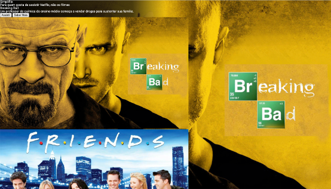

# 02 - Desafio CSS

Na aula passada nós desenvolvemos o nosso primeiro site, o [Simpliflix](01-simpliflix.md). Na aula de hoje nós vamos nos focar no estilo da página principal para relembrar e aprender alguns conceitos de CSS.

O nosso objetivo é partir desta página:

E produzir esta modificando apenas o CSS:

As instruções podem ser encontradas aqui: https://github.com/toshikurauchi/tecweb-2021-1-desafio-css

## IMPORTANTE

Esta atividade deve ser entregue e vale nota. Mais instruções no README do repositório.
