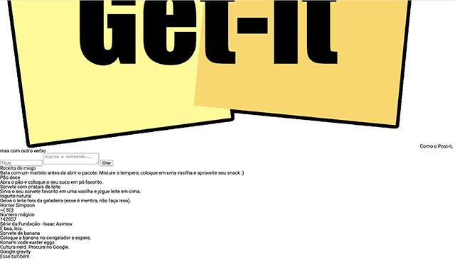
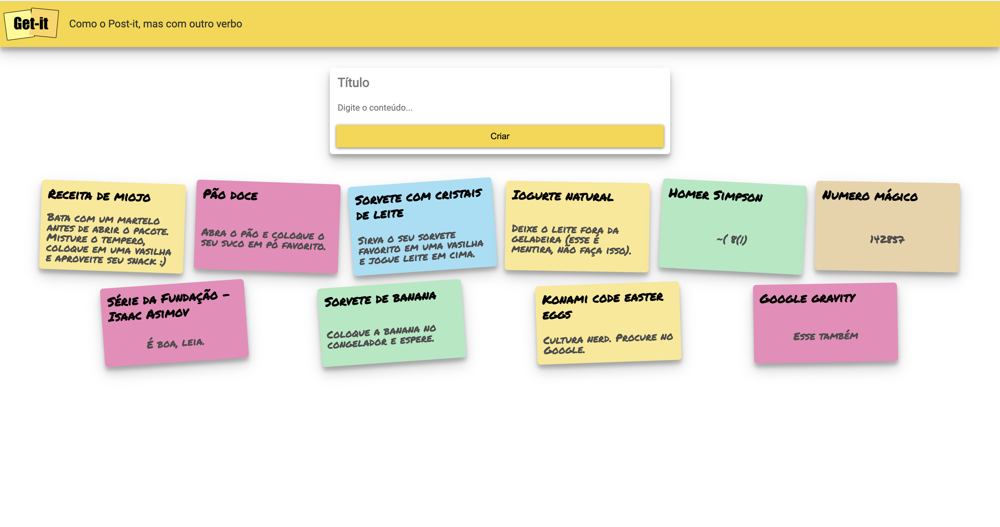

# 02 - Desafio CSS

## Desafio CSS

**Data de entrega: 28/08**

Na aula passada nós desenvolvemos a primeira versão do nosso primeiro site, o Get-it. Na aula de hoje nós vamos nos focar no estilo da página para relembrar e aprender alguns conceitos de CSS.

O nosso objetivo é partir da **Versão inicial:**

O seu objetivo é se aproximar o máximo possível da página a seguir (se precisar de uma imagem com resolução melhor [clique aqui](02-desafio-css/img/referencia.png)) utilizando apenas CSS puro.

**Versão esperada:**

O gif abaixo mostra a página sendo recarregada manualmente diversas vezes. **ATENÇÃO:** A animação é apenas para mostrar que a cada vez que a página é carregada, os elementos mudam de cor e rotação aleatoriamente. Não se preocupe, o javascript responsável pela aleatorização já está pronto.

## Instruções

Esta atividade deve ser realizada em duplas ou trios.

Baixe os arquivos base neste link [Download](02-desafio-css/desafio-css.zip)

Você pode modificar apenas o conteúdo do arquivo **getit.css**.

**Dica:** Você pode testar facilmente no seu computador executando o comando `python -m http.server` dentro da pasta `docs`.

## Entrega

A entrega deve ser feita via github. O grupo deve criar um repositório contendo os arquivos necessários.

A sua página deve **obrigatoriamente** estar disponível no GitHub pages seguindo [estes passos](https://docs.github.com/en/github/working-with-github-pages/configuring-a-publishing-source-for-your-github-pages-site).

Será considerado o último commit enviado antes do prazo.

Preencha o formulário a seguir, indicando os nomes dos integrantes do grupo e o endereço do repositório Github: https://forms.gle/X9sdv4kjuBk66wxA9

Pronto! Depois de seguir esses passos vocês devem ter acesso ao repositório da atividade.

## Rubrica

A nota deste trabalho é a soma dos pontos abaixo. Será feita uma inspeção visual, ou seja, os tamanhos, distâncias e cores não precisam ser **exatamente** iguais, mas devem ser visualmente bastante parecidos:

- Textos:
    - [1 pt] Posição, fonte e cores dos textos corretas

- App bar:
    - [1 pt] Tamanho do logo correto
    - [1 pt] Aparência correta (cor e sombra)

- Formulário:
    - [1 pt] Aparência dos campos de texto e do botão correta (fonte, cores, ausência de bordas, etc)
    - [1 pt] Aparência do formulário correta (sombra, proporções, distâncias, cantos arredondados, etc)
    - [1 pt] Posição do formulário correta (centralizado e com a distância correta com relação aos outros elementos principais)

- Cartões:

    - [1 pt] Espaçamentos corretos
    - [1 pt] Cores de fundo corretas
    - [1 pt] Aparência do cartão correta (sombra, proporções, distâncias, cantos arredondados, etc)
    - [1 pt] Rotação dos cartões

## Observações importantes

- No caso de entrega com atraso, a nota será a metade da soma dos pontos obtidos.
- **Trabalhos não identificados (sem nome neste arquivo README) serão considerados atrasados (veja o item acima).** O mesmo vale se o nome do aluno não constar entre os autores e for adicionado posteriormente.
- A nota de trabalhos com modificações em outros arquivos além do README.md e do [docs/getit.css](docs/getit.css) será limitada a no máximo 7 (equivalente ao conceito B). Modificações em outros arquivos devem ser explicitamente aprovadas pelo professor.
- Para este trabalho você não precisa se preocupar com a versão mobile da página. Ela será testada apenas em um monitor.
- Ao testar a sua página CSS no navegador é importante utilizar o **Hard Refresh/Hard Reload** ou utilize uma aba anônima.
