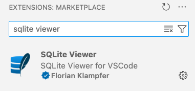

# Parte 1: Instalando o SQLite

Tecnicamente não é necessário instalar o SQLite, pois o Python já vem com uma versão do SQLite instalada. Para testar execute o comando no seu terminal. Se não der nenhum erro está tudo certo.

```shell
python -c 'import sqlite3'
```

Nós vamos instalar também uma extensão do VS Code que nos permite visualizar o banco de dados SQLite. Abra o VS Code e clique no ícone de extensões na barra lateral esquerda. Na barra de pesquisa digite `SQLite Viewer` e instale a extensão.


<figure markdown="span">
  { width="70%" }
  <figcaption>Extensão SQLite Viewer</figcaption>
</figure>

Depois de instalar o programa, siga para a :point_right: [parte 2](parte2.md).
