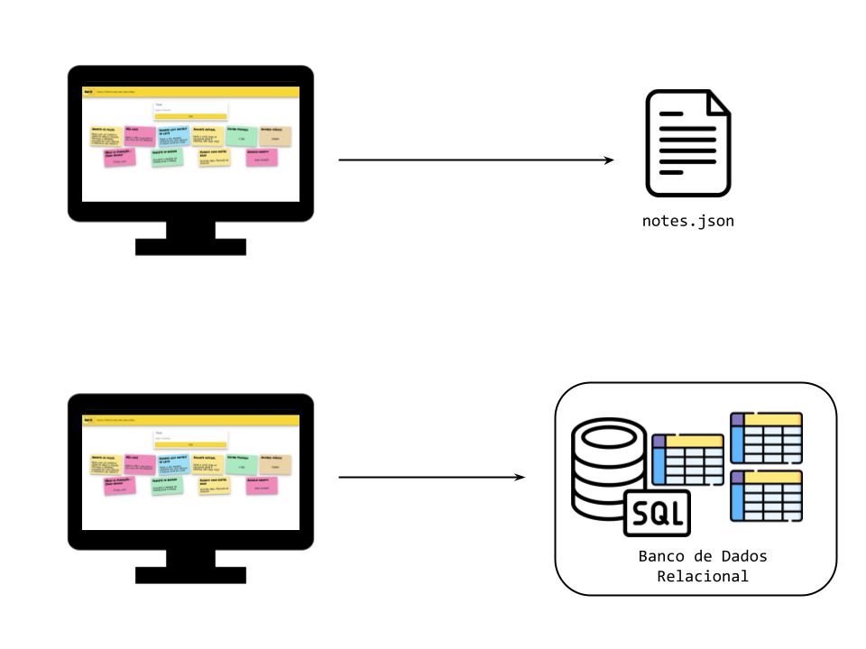
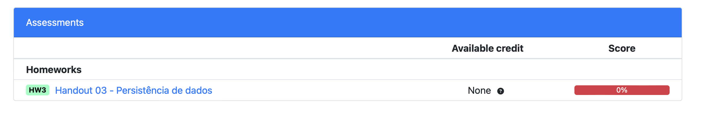
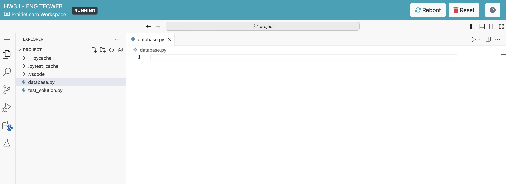
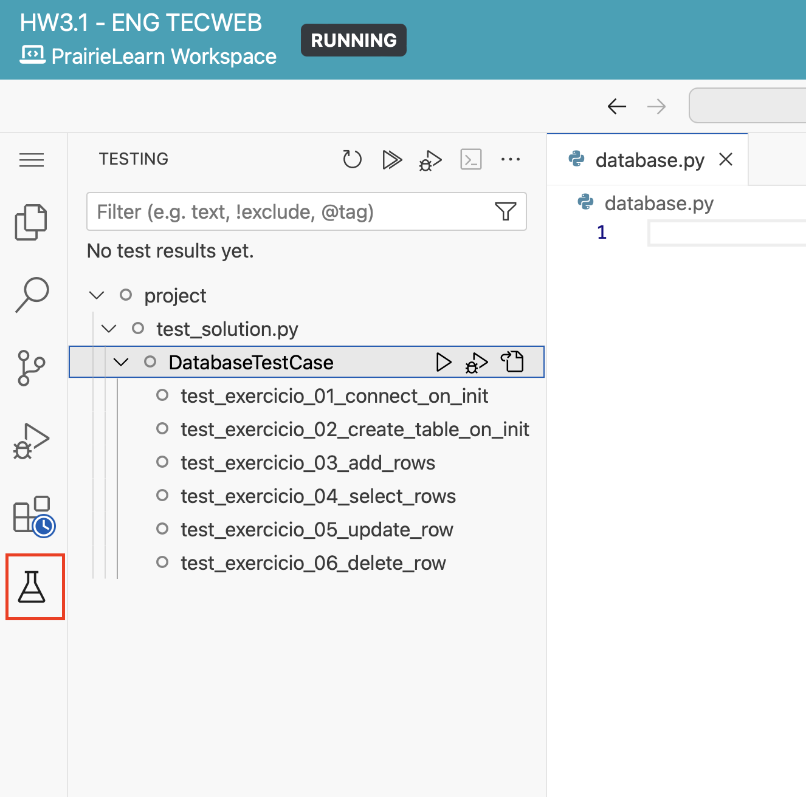
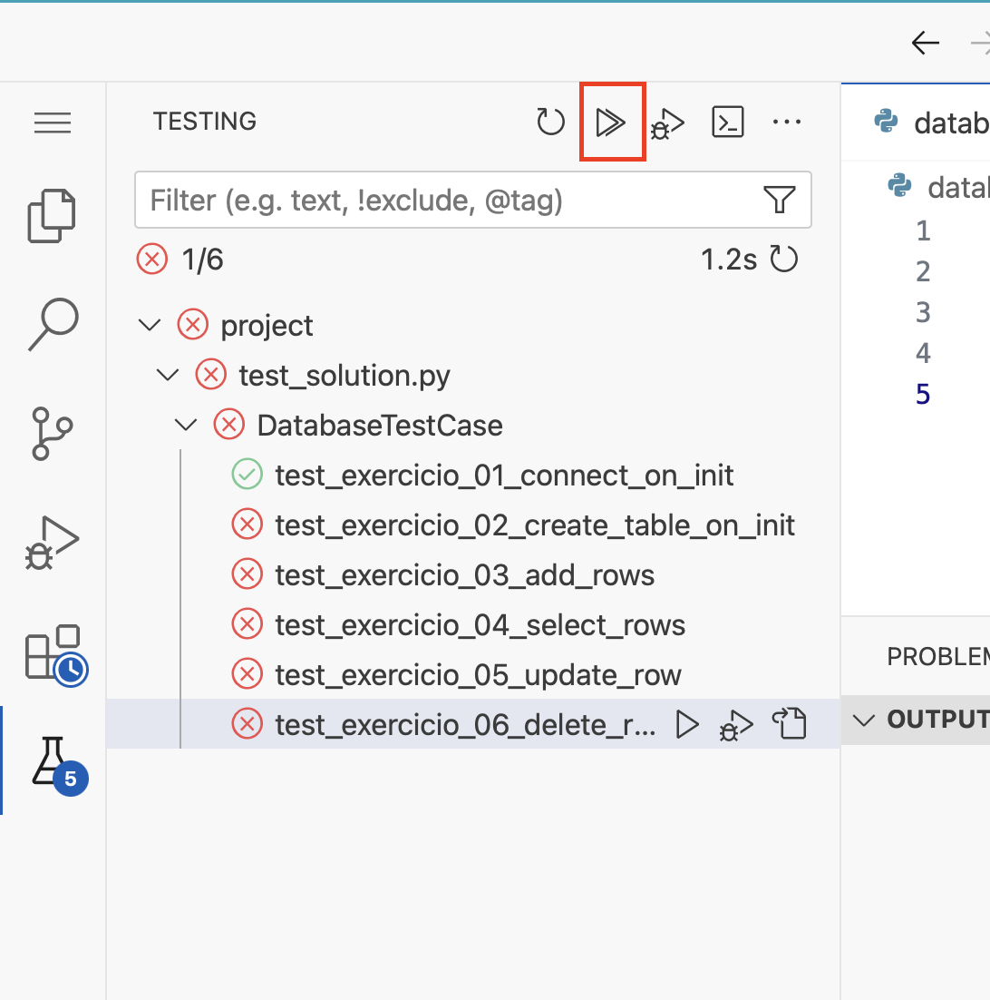
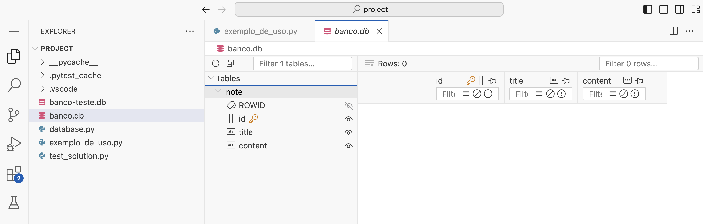

# Parte 2: Criando a tabela


<figure markdown="span">
  { width="70%" }
  <figcaption>Acessando dados</figcaption>
</figure>


De modo geral, sistemas de bancos de dados são programas que ficam executando infinitamente. Um programa externo pode se conectar a esse programa para interagir com o banco de dados. Esse vai ser o nosso primeiro passo. Como queremos realizar múltiplas operações no banco de dados, vamos encapsular (lembra desse termo de Desenvolvimento Colaborativo Ágil?) a responsabilidade de se comunicar com o banco de dados em uma classe chamada `#!python Database`. A função para se conectar ao banco de dados é:

```python
conexao = sqlite3.connect(NOME_DO_ARQUIVO_DO_BANCO)
```

Para mais detalhes, acesse :point_right: [Documentação SQLite3](https://docs.python.org/3/library/sqlite3.html?highlight=sqlite#tutorial){: target="_blank"}.

## Preparação para o exercício

Neste handout vamos realizar a implementação do código utilizando a ferramenta Prairie Learn. Nela será possível testar o código utilizando uma versão do VS Code online.

Para isso, acesse o link a seguir: [https://us.prairielearn.com/pl/course_instance/157660/assessment/2438387](https://us.prairielearn.com/pl/course_instance/157660/assessment/2438387){: target="_blank"}

<figure markdown="span">
    { width="30%" }
    <figcaption>Login no Prairie Learn</figcaption>
</figure>

- Escolha a opção de logar com uma conta Microsft.
- Faça o login utilizando seu email e senha do Insper.

<figure markdown="span">
    { width="100%" }
    <figcaption>Exercício</figcaption>
</figure>

- Clique no exercício `Handout 03 - Persistência de dados`
- Clique na questão.
- Em seguida, clique em `Open workspace` que abrirá uma nova aba com o VS Code online.

<figure markdown="span">
    { width="100%" }
    <figcaption>VS Code</figcaption>
</figure>


!!! example "Exercício 01"

    1. **Arquivo database.py** Encontre um arquivo chamado `database.py`. 
    1. **Importe:** Nesse arquivo, importe o pacote `#!python sqlite3`.
    1. **Criando a Classe** Nesse arquivo, crie uma classe chamada `#!python Database`. 
        
        1. O construtor da classe receberá o nome do banco de dados. 
        2. Na construção, o objeto deve guardar a conexão com o banco (resultado da chamada da função `#!python sqlite3.connect` mostrada acima) em um atributo chamado `#!python conn`.

        **Atenção:** Note que o arquivo do banco de dados deve possui a extensão `.db` (exemplo: NOME_DO_ARQUIVO + '.db').

        Se não se lembrar a sintaxe de classes em Python, procure no Google ou acesse a :point_right:  [documentação](https://docs.python.org/3/tutorial/classes.html#class-and-instance-variables){: target="_blank"}. 


    1. **Testando a solução:** Para testar o seu código, procure o ícone a seguir na barra lateral do VS Code.

        <figure markdown="span">
            { width="40%" }
            <figcaption>Testes</figcaption>
        </figure>

    1. Clique no botão no `Run Test` para rodar os testes. 

        Se tudo der certo, o ícone ficará verde, como na imagem abaixo.

        <figure markdown="span">
            { width="40%" }
            <figcaption>Testes passando</figcaption>
        </figure>

## Criando a tabela

Para o nosso projeto vamos precisar de apenas uma tabela. Essa tabela vai representar as anotações. 


<figure markdown="span">
  { width="80%" }
  <figcaption>Tabela Note</figcaption>
</figure>

Para criar uma tabela com SQL utilizamos o comando:

```sql
CREATE TABLE NOME_DA_TABELA COLUNAS_DA_TABELA;
```

Uma tabela só pode ser criada uma única vez. Você deveria encontrar um lugar para colocar o código de criação da tabela que só fosse executado uma única vez. Se você tentar criar a tabela mais de uma vez ocorrerá um erro.

Para não precisar se preocupar com isso você pode usar adicionar `#!sql IF NOT EXISTS` para a tabela ser criada apenas se ainda não existir. Assim, você pode executar o comando múltiplas vezes sem se preocupar. O comando ficaria então:

```sql
CREATE TABLE IF NOT EXISTS NOME_DA_TABELA (COLUNAS_DA_TABELA);
```

As colunas da tabela são separadas por vírgula e são indicadas como `#!sql NOME_DA_COLUNA TIPO_DA_COLUNA RESTRICOES_ADICIONAIS`. Alguns exemplos:

- `#!sql nome_da_rua TEXT NOT NULL` define uma coluna chamada `nome_da_rua`, na qual podem ser inseridos apenas valores do tipo texto e ela não pode ser vazia;
- `#!sql cpf TEXT NOT NULL UNIQUE` define uma coluna chamada `cpf`, na qual podem ser inseridos apenas valores do tipo texto e os valores devem ser únicos, ou seja, não pode haver dois CPFs iguais;
- `#!sql identificador INTEGER PRIMARY KEY` define uma coluna chamada `identificador`, na qual podem ser inseridos apenas valores do tipo inteiro e ela será utilizada como **chave primária** (explicaremos abaixo o que isso significa).

Você poderia então, por exemplo, criar a tabela `dados_pessoais` com o comando (note os parênteses e o ponto e vírgula):

```sql
CREATE TABLE IF NOT EXISTS dados_pessoais ( nome_da_rua TEXT NOT NULL,
                                            cpf TEXT NOT NULL UNIQUE,
                                            identificador INTEGER PRIMARY KEY);
```


!!! info "Chave primária"
    Uma das características de bancos de dados é a possibilidade de encontrar dados rapidamente. Para isso é comum o uso de identificadores únicos. Identificadores do tipo inteiro, além de facilitarem a busca, podem ser utilizados em diversas otimizações.

### Enviando um comando SQL para o banco de dados

Ok, já sei qual é o comando para criar uma tabela, mas como eu o envio para o banco de dados? Agora é a hora de utilizarmos a conexão que criamos no exercício anterior. O objeto armazenado no atributo `#!python conn` possui um método chamado `#!python execute`, que recebe uma string contendo um comando SQL e envia para o banco de dados.

Caso queira, procure um exemplo do uso do método `#!python execute` no link a seguir: :point_right: [Documentação SQLite3](https://docs.python.org/3/library/sqlite3.html?highlight=sqlite#tutorial){: target="_blank"}.


!!! example "Exercício 02"
    Modifique o código do arquivo `database.py` para que ele crie uma tabela no construtor da classe `#!python Database`. 
    
    Altere o exemplo abaixo, para criar uma tabela que deve se chamar `note` e deve ter as colunas `id` (chave primária do tipo inteiro), `title` (do tipo string), `content` (do tipo string e não pode ser vazia).

    ```sql
    CREATE TABLE IF NOT EXISTS dados_pessoais ( identificador INTEGER PRIMARY KEY,
                                                nome_da_rua TEXT NOT NULL,
                                                cpf TEXT NOT NULL UNIQUE );
    ```

   
    Normalmente, utilizamos o comando acima no sistema de banco de dados. Porém, neste exercício queremos utilizar o Python para enviar o comando para o banco de dados. 

    Veja um exemplo de como fazer isso: [Documentação SQLite3](https://docs.python.org/3/library/sqlite3.html?highlight=sqlite#tutorial){: target="_blank"}

    Rode os testes e se tudo estiver correto, o teste com o nome `exercicio_02_create_table_on_init` deverá passar com sucesso.

### Validando o resultado

Crie um arquivo chamado `exemplo_de_uso.py` na mesma pasta com o seguinte conteúdo:

```python
from database import Database

db = Database('banco')
```

Após executar este programa, um arquivo chamado `banco.db` deve ter aparecido na sua pasta. Esse arquivo contém todo o seu banco de dados. Na maioria dos bancos de dados os arquivos não ficam tão acessíveis, mas como o SQLite é uma opção mais simples e direta, se quiser apagar o banco, basta apagar esse arquivo (e na verdade é o que fazemos no `test_database.py`).

#### Visualizando o banco de dados 

Baixe a extensão SQLite Viewer para o VS Code.

Clique no arquivo `banco.db` e poderemos visualizar o banco de dados.
Você deve ver uma tela parecida com esta:



Veja que a tabela foi criada e as colunas estão listadas corretamente.

Agora que a tabela foi criada, podemos ir para a [próxima parte](parte3.md).
