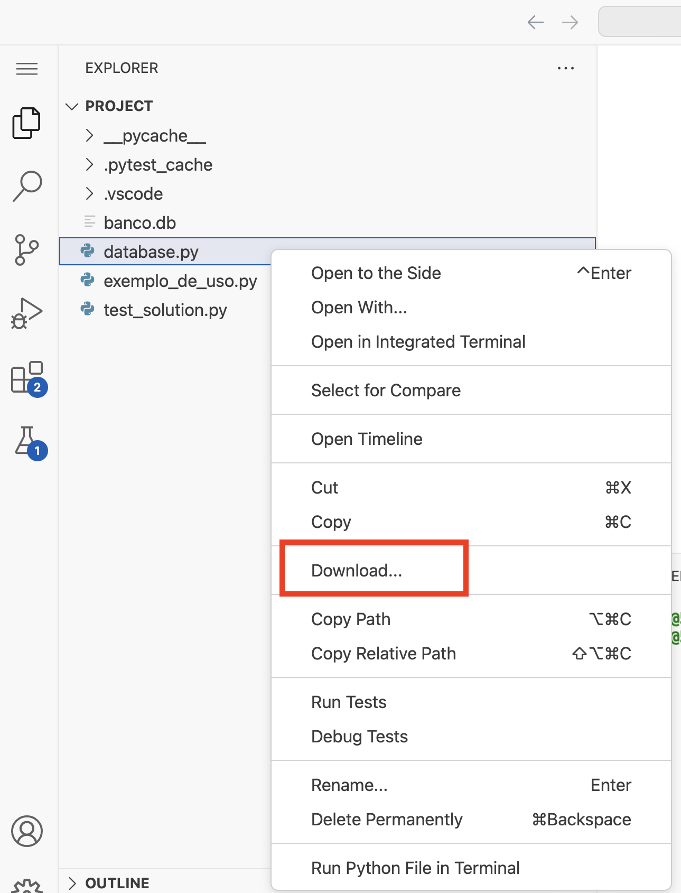
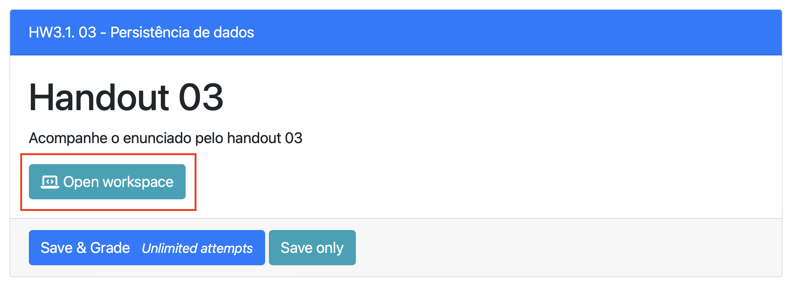

# Parte 6: Apagando dados

A última operação que falta para completarmos as operações CRUD (<b>C</b>reate, <b>R</b>ead, <b>U</b>pdate, <b>D</b>elete) é apagar uma linha. Para isso vamos utilizar o comando `#!sql DELETE`:

```sql
DELETE FROM NOME_DA_TABELA WHERE CONDICAO;
```

Por exemplo:

```sql
DELETE FROM dados_pessoais WHERE identificador = 5
```

Note que depois dessa operação não vai mais existir uma linha com `identificador` igual a `5`. Os identificadores não são atualizados para preencher valores inexistentes.

!!! example "Exercício 06"
    Implemente o método `#!python delete(self, note_id)`, que recebe o valor de um `id` e apaga essa entrada do banco de dados. Obs: lembre-se de chamar o método `#!python commit` depois do `#!python execute`.

    Ao finalizar, rode os testes e se tudo estiver certo, o teste com o nome `exercicio_06_delete_row` deverá passar com sucesso.

!!! example "Exercício 07"
    Salve os arquivos `database.py` e `exemplo_de_uso.py` no repositório do Projeto 1A e faça um commit.

    <figure>
        { width="30%" }
        <figcaption>Salvando arquivo</figcaption>
    </figure>

    Além disso, volte para a página do Prairie Learn e clique em `Save and Grade`.

    <figure>
        { width="50%" }
        <figcaption>Save and Grade</figcaption>
    </figure>


<!-- !!! example "Exercício 07"
    Depois que estiver com todos os testes passando, altere o código construído no [Handout 1](../01-getit.md) para armazenar as notas no banco de dados. -->
