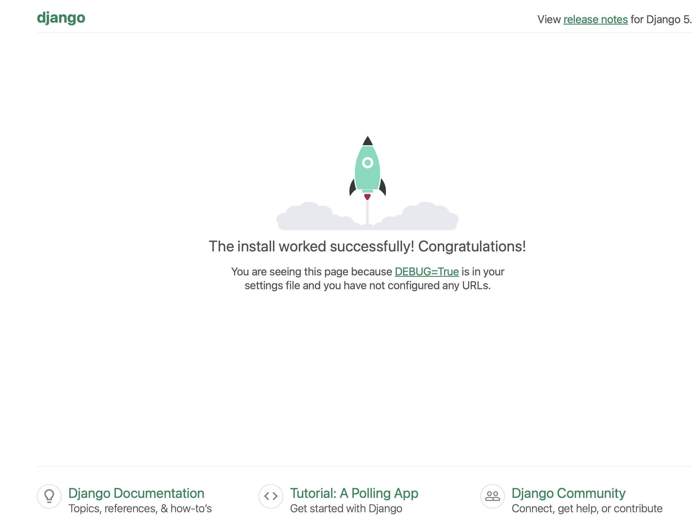

# Parte 1: Iniciando o projeto

Assumindo que você está dentro da pasta do projeto e o ambiente virtual está ativado, execute o comando a seguir:

    django-admin startproject getit .

Esse comando vai criar a estrutura do projeto chamado `getit` na pasta atual (`.`). Sua pasta conterá os seguintes arquivos:

```
pasta-do-projeto/
    manage.py
    env/
    getit/
        __init__.py
        settings.py
        wsgi.py
        asgi.py
        urls.py
```

Como já vimos, a pasta `env` contém todos os arquivos referentes ao ambiente virtual. Os outros arquivos são:

- `manage.py`: programa com [diversos comandos](https://docs.djangoproject.com/en/5.0/ref/django-admin/#available-commands){:target="_blank"} que automatizam tarefas relacionadas ao seu projeto Django.
- `getit/__init__.py`: esse é um arquivo vazio. O `__init__.py` é a forma de dizer para o Python que a pasta `getit` é um pacote. Se quiser saber mais, consulte a [documentação do Python](https://docs.python.org/3/tutorial/modules.html#tut-packages){:target="_blank"}.
- `getit/settings.py`: as configurações do seu projeto estão concentradas neste arquivo. Para saber mais, consulte a [documentação do Django](https://docs.djangoproject.com/en/5.0/topics/settings/){:target="_blank"}. Alguns exemplos: configuração do banco de dados, língua padrão da aplicação, localização das pastas de arquivos estáticos (CSS, JS, imagens, etc.).
- `getit/urls.py`: lembra das rotas na parte A? Este arquivo define uma função para ser executada para cada rota da sua aplicação.
- `getit/asgi.py` e `getit/wsgi.py`: arquivos utilizados para disponibilizar o seu projeto em um servidor.

Vamos testar essa configuração inicial:

    python manage.py runserver

Acesse a página em: [`http://localhost:8000`](http://localhost:8000){:target="_blank"}.

Você deve se deparar com algo assim:

<figure markdown="span">
    { width="50%" }
    <figcaption>Página Inicial Padrão</figcaption>
</figure>

## Calma, mas eu nem escrevi código ainda!

Pois é, essa é uma das características desse tipo de framework. Muito do trabalho realizado por qualquer servidor web é bastante repetido (inclusive, você implementou isso na parte A):

1. Receber a requisição;
2. Processar a requisição para extrair as informações enviadas pelo cliente (ex: rota, verbo HTTP, parâmetros, etc.);
3. Construir a string de resposta (inclusive com várias outras informações no cabeçalho além do que usamos no projeto A);
4. Enviar a resposta para o cliente.

Além disso, várias outras tarefas são bastante comuns: verificar se existe um usuário associado àquela requisição, verificar se o usuário realmente é quem ele diz ser (autenticação), verificar se o usuário tem permissão para acessar aquela página/recurso específica, etc.

Todo esse trabalho repetido é executado pelo framework, no caso o Django, facilitando muito o desenvolvimento da aplicação. O que sobra para implementarmos é o que acontece depois que a requisição chegou no servidor e antes da resposta ser enviada para o cliente.

!!! danger "Importante"
    Essa é apenas uma introdução e por esse motivo, os conceitos são apresentados de forma bastante simplificada. Em especial, o último parágrafo é bastante impreciso. A ideia é que você compreenda melhor o que está acontecendo ao longo do semestre e conforme você ganha mais experiência no desenvolvimento web.

Então vamos implementar a parte que nos cabe. É só seguir para o [próximo passo](parte2.md).
