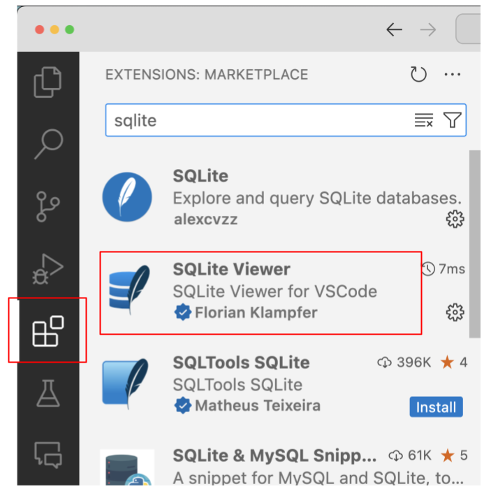
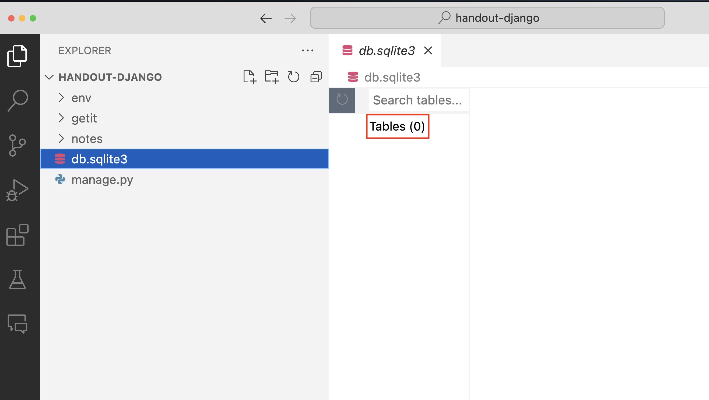
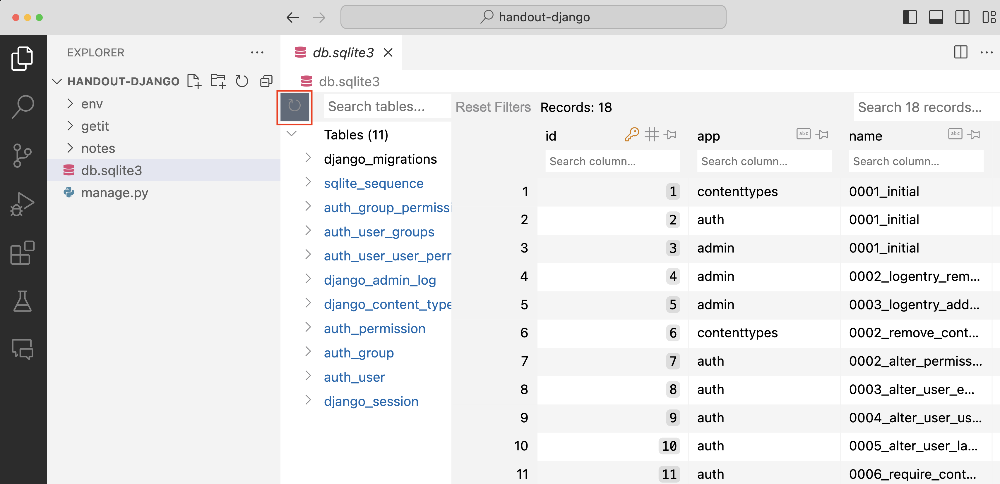
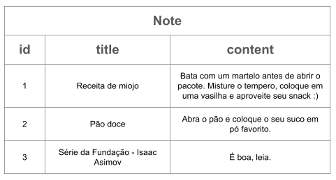
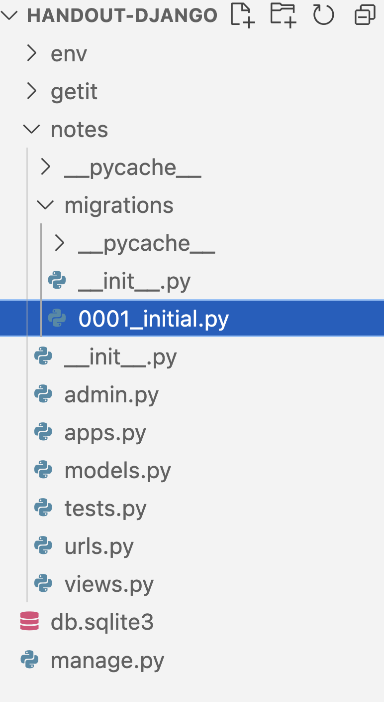
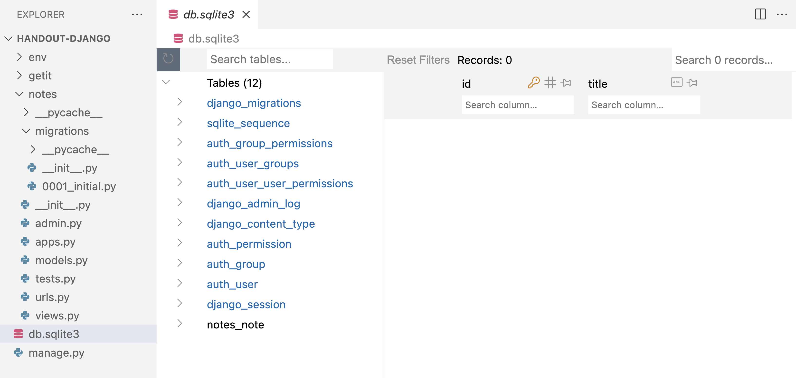
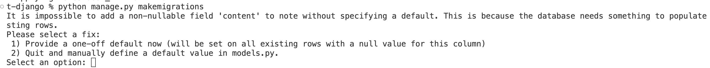
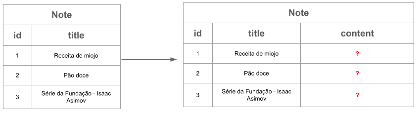
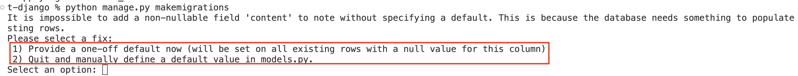

# Parte 3: Integrando com o banco de dados

No handout 2 nós começamos a utilizar o SQLite para armazenar os dados do sistema. Para interagir com o banco foi necessário construir as strings com os comandos SQL, misturando a sintaxe do Python com a do SQL. A boa notícia é que o Django já possui uma integração com o banco de dados pronta. Melhor ainda, é muito simples trocar o banco de dados utilizado (SQLite, PostgreSQL, MySQL, etc.).

Abra o arquivo `getit/settings.py`. Procure o seguinte trecho de código:

```python
DATABASES = {
    'default': {
        'ENGINE': 'django.db.backends.sqlite3',
        'NAME': BASE_DIR / 'db.sqlite3',
    }
}
```

Esse dicionário está configurando o SQLite como o banco de dados da aplicação (será criado um banco de dados no arquivo `db.sqlite3` dentro da pasta principal do seu projeto). Se você quiser utilizar outro banco de dados, basta instalar as bibliotecas necessárias (em geral disponíveis para ser instaladas via `pip install`) e modificar os itens desse dicionário. Se quiser saber mais, consulte a [documentação do Django](https://docs.djangoproject.com/en/4.2/intro/tutorial02/#database-setup).

Já que estamos no arquivo de configuração, aproveite para procurar pela lista `#!python INSTALLED_APPS`. Ela deve ser parecida com essa:

```python
INSTALLED_APPS = [
    'django.contrib.admin',
    'django.contrib.auth',
    'django.contrib.contenttypes',
    'django.contrib.sessions',
    'django.contrib.messages',
    'django.contrib.staticfiles',
]
```

Na [parte 2](parte2.md) comentamos que um projeto é composto por múltiplos apps, que são partes de um sistema. A lista `#!python INSTALLED_APPS` define os nomes dos apps utilizados pelo seu projeto. Por exemplo, há um app que é responsável por gerenciar arquivos estáticos (imagens, css, javascript, etc.), outro responsável pela autenticação (usuário, senha, mudança de senha) e assim por diante.

Nós já criamos um app para o nosso projeto, o `notes`. Vamos adicioná-lo na lista de apps nas configurações.

!!! question choice "Exercício"
    Adicione o `#!python 'notes.apps.NotesConfig'` como o primeiro elemento da lista `#!python INSTALLED_APPS`.

    ??? info "O que raios é `#!python 'notes.apps.NotesConfig'`?"
        Esse é o nome completo da classe de configuração. Ela foi criada automaticamente para você. Se tiver curiosidade, abra o arquivo `notes/apps.py`.

    - [X] **ADICIONEI** a configuração!
    - [ ] **NÃO ADICIONEI** a configuração!
    
    !!! details "Resposta"
        Ao criar um app, no nosso caso `notes`, é necessário indicar que vamos utilizar este app em nosso projeto. Se essa estapa não for realizada, o projeto ignorará o app `notes`.

## Banco de dados

Projetos Django utilizam o banco de dados relacional `SQLite3` por padrão. Verifique nos arquivos do projeto se existe o arquivo `db.sqlite3`. 

Vamos instalar uma extensão do VS Code para que possamos visualizar o banco de dados do nosso projeto. 

1. Com o VS Code aberto, vá em `Extensions`/`Extensões`
2. Na barra de busca, digite `sqlite`
3. Instale a extensão `SQLite Viewer`

<figure markdown="span">
    { width="40%" }
</figure>

Ao clicar no arquivo `db.sqlite3`, podemos visualizar o banco de dados do projeto. Porém, é possível notar que o banco de dados está vazio.

<figure markdown="span">
    { width="60%" }
</figure>


O nosso projeto já tem diversos apps instalados. Vários desses apps utilizam o banco de dados para armazenar pelo menos uma tabela. Para que essas tabelas sejam criadas vamos utilizar o comando (no terminal):

    python manage.py migrate

Atualize o banco de dados e veja que várias tabelas foram criadas. O projeto Django já oferece uma estrutura pronta para criar usuários, senhas, permissões entre outras coisas.

<figure markdown="span">
    { width="60%" }
</figure>

## Criando seus próprios modelos

Em nosso projeto, precisamos criar uma tabela no banco de dados armazenar as informações das anotações. Queremos algo como a imagem a seguir:

<figure markdown="span">
    { width="60%" }
</figure>

No projeto 1A tivemos que implementar uma classe `Database` com comandos em `SQL` para criarmos a tabela `note`. Agora que estamos utilizando o framework Django, não precisamos escrever `SQL`. 

O Django já tem uma integração com o banco de dados. Para isso nós precisamos criar classes do Python para representar os nossos modelos, cujos dados serão armazenados em tabelas nos bancos de dados relacionais. Vamos criar o nosso primeiro modelo.

!!! example "Exercício"
    Substitua o conteúdo do arquivo `notes/models.py` por:

    ```python
    from django.db import models


    class Note(models.Model):
        title = models.CharField(max_length=200)
    ```

    Nesse código nós criamos um modelo chamado `#!python Note` que possui um atributo `#!python title`, que será mapeado no banco de dados em uma coluna cujos valores são strings de no máximo 200 caracteres.

!!! question choice "Exercício"
    Para que a tabela `note` seja criada no banco de dados de acordo com o modelo que criamos acima, precisamos pedir para o Django criar as migrações. Uma migração é a forma do Django armazenar modificações no banco de dados (criação de novas tabelas, por exemplo). Para isso, execute o comando abaixo:

        python manage.py makemigrations


    - [X] **FINALIZEI** esta etapa!
    - [ ] **NÃO FINALIZEI** esta etapa!
    
    !!! details "Resposta"
        Após executar este comando, um arquivo será criada na pasta `notes/migrations`. Não é necessário que entenda o conteúdo destes arqvuivos, basta saber que são scripts com instruções para  atualização do banco de dados. No nosso caso, o script terá instruções para criar uma tabela nova chamada `notes_note` com o campo `title`. 

        O Django utiliza o padrão de nome para a criação das tabelas sendo `AppName_ModelName`, desta forma, como nosso app chama `notes` e o modelo chama `note`, a tabela criada será `notes_note`.

        <figure markdown="span">
            { width="20%" }
        </figure>


!!! example "Exercício"
    Se procurarmos a tabela `notes_note` no banco de dados não vamos encontrar, pois ainda não efetuamos as alterações no banco de dados.

    Para aplicar as novas mudanças no banco de dados, precisamos executar outro comando.
        
        python manage.py migrate

    Nós já havíamos executado o comando `python manage.py migrate` para criar as tabelas dos apps no banco de dados. Como o nosso app `notes` também está entre os `#!python INSTALLED_APPS`, esse mesmo comando também vai criar a tabela do modelo `#!python Note`.

    Agora a tabela deve aparecer no banco de dados:

    <figure markdown="span">
        { width="100%" }
    </figure>

    **Note que** não colocamos o campo `id` na model, porém a tabela já possui uma coluna para o `id`.
    Como todas as tabelas precisarão de uma coluna para armazenar o identificador, o próprio Django se responsabiliza por criar essa coluna.

!!! question choice "Exercício"
    Nossa tabela já está quase pronta, porém, falta a coluna `content`.
    
    Leia a [documentação do `#!python CharField`](https://docs.djangoproject.com/en/5.0/ref/models/fields/#charfield){:target="_blank"}. Ele não é recomendável para textos grandes. Crie na classe `#!python Note` um atributo `#!python content` com o tipo apropriado.

    Existem diversos tipos de colunas que podem ser utilizados nos modelos. Por exemplo, relacionamentos entre entidades (tabelas) podem ser representados com o `models.BooleanField`, `models.DateField`, `models.DecimalField` entre outros.

    - [X] **CRIEI** o atributo para `content`!
    - [ ] **NÃO CRIEI** o atributo para `content`!
    
    !!! details "Resposta"
        Na documentação do `CharField` é possível encontrar a menção do campo `TextField` para textos maiores.


Sempre que atualizamos o arquivo `models.py` precisamos executar os comandos:

    python manage.py makemigrations

e

    python manage.py migrate

Lembrando que, o primeiro comando cria o script de criação/atualização da tabela. O segundo comando aplica esse script, efetivamente aplicando as mudanças no banco de dados.

### Possível problema com makemigration

Ao executar o comando `python manage.py makemigrations` você deve ter se deparado com a seguinte mensagem:

<figure markdown="span">
    { width="100%" }
</figure>

Explicando um pouco o que aconteceu.
Criamos o modelo `Note` contento apenas as colunas `id` e `title`. Em seguida, decidimos adicionar uma nova coluna `content`.

O problema é que o banco de dados pode já possuir valores armazenados. O que fazer com eles? Como atualizá-los? Qual deve ser o valor padrão utilizado nessa nova coluna para as linhas já existentes no banco? As migrações se responsabilizam por esse processo, facilitando a evolução do banco de dados em produção.

<figure markdown="span">
    { width="70%" }
</figure>

Se olhamos com atenção para a mensagem apresentada pelo Django, podemos ver que ele oferece duas alternativas.

<figure markdown="span">
    { width="100%" }
</figure>
    
!!! Example "Opção 1"
    Caso opte pela opção 1, você deve digitar no terminal o número `1` e pressione enter.

    Em seguida, você deve inserir o valor padrão para a nova coluna, caso hajam dados já salvos no banco de dados.

    Em nosso caso, vamos escolher a string vazia, desta forma, digite as "" (abrindo e fechando as aspas) e pressione enter.

    Pronto! Pode rodar o comando `python manage.py migrate` e verificar se uma nova coluna foi criada.

!!! Example "Opção 2"


Ok, nós criamos o banco de dados, mas como eu adiciono dados nele e vejo o que está armazenado? Boa pergunta! Siga para a [parte 4](parte4.md)!
