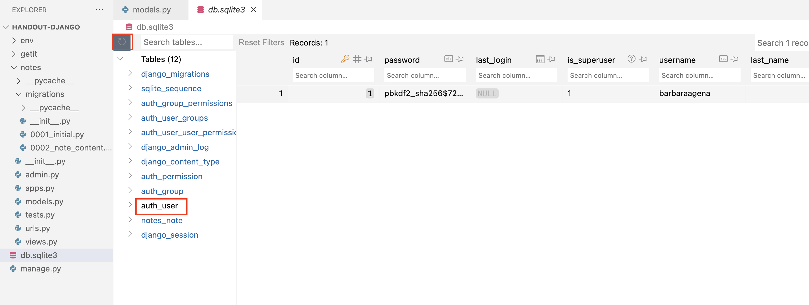
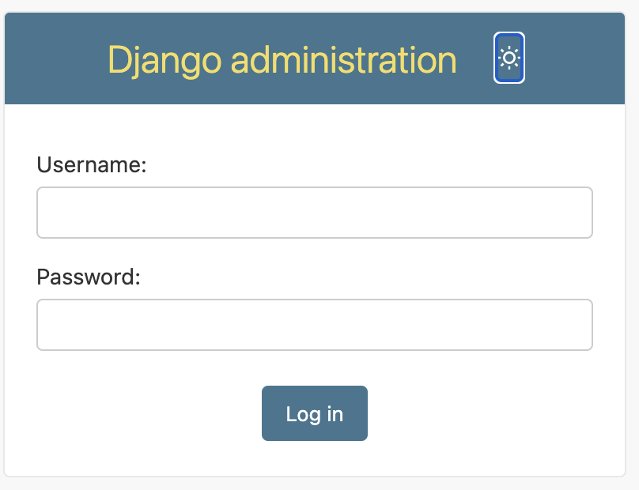
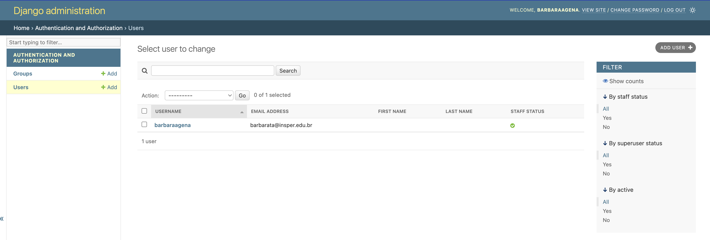
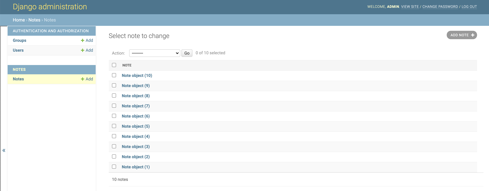
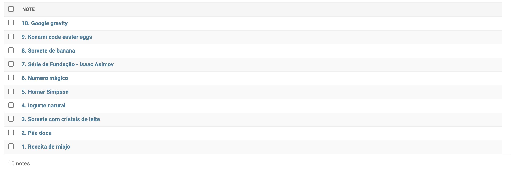

# Parte 4: O Django Admin

É comum precisarmos criar um site específico para gerenciar (adicionar, remover, editar) os conteúdos da nossa página. Em geral, essas páginas de administração não precisam ser particularmente bonitas ou criativas. Assim, o Django disponibiliza uma interface de administração criada automaticamente.

Para ter acesso a essa página vamos precisar criar um usuário administrador. Execute no terminal o comando a seguir e siga os passos para criar o seu usuário:

    python manage.py createsuperuser

!!! info "Cadastro de usuário"
    O comando acima irá pedir alguns dados para cadastro. Ao digitar a senha, esta não aparecerá no terminal.
    ```
    Username (leave blank to use 'barbaraagena'): 
    Email address: 
    Password: 
    Password (again): 
    ```

    É possível verificar que um usuário foi criado no banco de dados, na tabela `auth_user`.
    

    <figure markdown="span">
        { width="60%" }
    </figure>

Agora execute o servidor:

    python manage.py runserver

E acesse a página de administração em [`http://localhost:8000/admin/`](http://localhost:8000/admin/). 

Faça o Login com as informações do usuário que acabou de criar na etapa anterior.

<figure markdown="span">
    { width="30%" }
</figure>

Ao logar, nos deparamos com uma tela em que é possível criar usuários manualmente a partir dessa interface.

<figure markdown="span">
    { width="70%" }
</figure>


## Cadastrando anotações via Django-admin

É possível criar novas anotações via essa interface Admin. Para isso, você vai precisar de muito pouco código.

!!! example "Exercício"
    Abra o arquivo `notes/admin.py` e substitua o seu conteúdo por:

    ```python
    from django.contrib import admin
    from .models import Note


    admin.site.register(Note)
    ```

    Agora sim, entre novamente na página de admin (não precisa nem reiniciar o comando `runserver` - ele já faz isso automaticamente).

!!! example "Exercício"
    Utilize o Django Admin para criar algumas anotações.

Depois de adicionar algumas anotações, a sua lista deve estar mais ou menos assim:



Não sei para você, mas para mim esses nomes `Note object (x)` não parecem muito úteis. Seria melhor se ele mostrasse o título da anotação. A boa notícia é que você pode modificar o que aparece na lista da página de admin. Para mostrar um objeto qualquer, por exemplo `note`, na interface, ele utiliza a função `#!python str` para transformar o objeto em uma string (`#!python str(note)`). Nós podemos modificar essa funcionalidade sobrescrevendo (lembra dessa palavra de Desenvolvimento Colaborativo Ágil?) [o método mágico `#!python __str__()`](https://docs.python.org/3/reference/datamodel.html#object.__str__).

!!! example "Exercício"
    Implemente o método `#!python __str__(self)` na classe `#!python Note`. Ele deve devolver uma string no seguinte formato: `ID. TITULO`, onde `ID` é o [id do objeto](https://docs.djangoproject.com/en/6.0/topics/db/models/#automatic-primary-key-fields) e `TITULO` é o título do objeto (atributo `title`).

    Depois de implementar esse método, a lista de anotações na tela de admin deve estar mais ou menos assim:

    

Agora que você já adicionou algumas anotações ao banco de dados, siga para a [próxima parte de handout](parte5.md).
