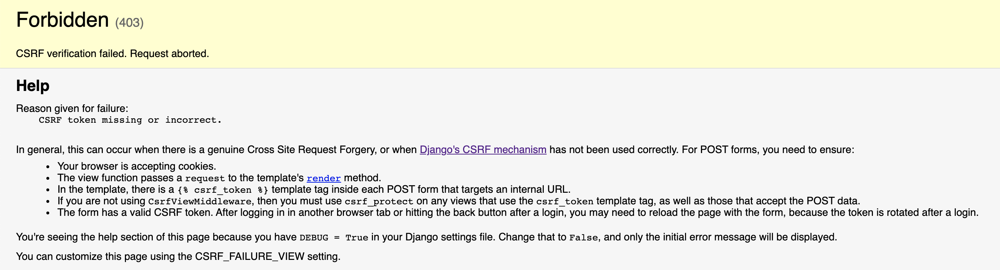

# Parte 6: Trabalhando com formulários e o método POST

Faça um teste na sua página. Preencha os dados no formulário e clique no botão para submetê-lo. Uma página parecida com essa deve ter aparecido:



O [*Cross Site Request Forgery*](https://docs.djangoproject.com/en/6.0/ref/csrf/){:target="_blank"} é um tipo de ataque no qual um site malicioso utiliza um link/form/javascript para submeter dados utilizando um usuário logado no seu sistema. Para se proteger desse tipo de ataque, todos os formulários do seu sistema devem enviar, através de um [campo escondido](https://www.w3schools.com/tags/att_input_type_hidden.asp){:target="_blank"}, um token gerado pelo servidor. Assim, o servidor saberá que a requisição foi feita por um cliente confiável.

Isso pode soar complexo, mas basta inserir uma template tag no seu formulário. O Django cuida do resto.

!!! example "Exercício"
    Modifique o `#!html <form>` do arquivo `index.html` com o seguinte conteúdo:

    ```html hl_lines="2"
    <form method="post">
      
      <label for="titulo">Título</label>
      <input id="titulo" type="text" name="titulo" />
      <label for="detalhes">Detalhes</label>
      <textarea id="detalhes" name="detalhes"></textarea>
      <input type="submit" />
    </form>
    ```

    Se você testar novamente, o erro não deve ocorrer mais.

## Recebendo requisições POST

O próximo passo é diferenciar o tipo da requisição recebida. O objeto `#!python request` recebido como argumento nas suas views possui um [atributo `method`](https://docs.djangoproject.com/en/6.0/ref/request-response/#django.http.HttpRequest.method){:target="_blank"}. Esse atributo é uma string contendo o nome do método em letras maiúsculas (`#!python 'GET'` ou `#!python 'POST'`). Além disso, caso seja uma requisição do tipo POST, haverá também um [atributo `POST`](https://docs.djangoproject.com/en/6.0/ref/request-response/#django.http.HttpRequest.POST){:target="_blank"} com um dicionário (na verdade um *dictionary-like*) cujas chaves são os nomes (atributo `#!html name`) dos inputs e os valores são os valores contidos no input.

!!! example "Exercício"
    Modifique o arquivo `notes/views.py` com o seguinte conteúdo:

    ```python hl_lines="1 6-11"
    from django.shortcuts import render, redirect
    from .models import Note


    def index(request):
        if request.method == 'POST':
            title = request.POST.get('titulo')
            content = request.POST.get('detalhes')
            # TAREFA: Utilize o title e content para criar um novo Note no banco de dados
            return redirect('index')
        else:
            all_notes = Note.objects.all()
            return render(request, 'notes/index.html', {'notes': all_notes})

    ```

    Como você pode ver no comentário, você tem a tarefa de criar um novo `Note` no banco de dados com o título e conteúdo recebidos pela requisição. Esta página da documentação pode ser útil: [https://docs.djangoproject.com/en/6.0/topics/db/queries/#creating-objects](https://docs.djangoproject.com/en/6.0/topics/db/queries/#creating-objects){:target="_blank"}

!!! tips "Outra forma de acessar valores em um dicionário Python"
    No código do exercício anterior, as linha marcadas estão acessando valores em um dicionário.
    
    ```python hl_lines="6-7"
    from django.shortcuts import render, redirect
    from .models import Note

    def index(request):
        if request.method == 'POST':
            title = request.POST.get('titulo')
            content = request.POST.get('detalhes')
            # TAREFA: Utilize o title e content para criar um novo Note no banco de dados
            return redirect('index')
        else:
            all_notes = Note.objects.all()
            return render(request, 'notes/index.html', {'notes': all_notes})
    ```

    O comando `request.POST` é o mesmo dicionário Python `params` utilizado no Projeto 1A. Caso não se lembre, esse dicionário possui a seguinte estrutura.

    ```json
    params = {
        "titulo": "Receita de miojo",
        "detalhes": "Bata com um martelo antes de abrir o pacote. Misture o tempero, coloque em uma vasilha e aproveite seu snack :)"
    }
    ```

    Os comandos a seguir produzem o mesmo resultado:

    ```python
    print(params.get("titulo"))
    print(params["titulo"])
    ```

    Porém, os códigos abaixo não produzem o mesmo resultado:
    
    ```python
    print(params.get("tecweb"))
    print(params["tecweb"])
    ```

!!! question choice "Adicionando Estilo CSS"
    Adicione os arquivos `getit.css` e `getit.js` em seu projeto dentro da pasta `notes/static/notes`.

    Além disso, faça as modificações necessárias nos arquivos `notes/templates/notes/base.html` e `notes/templates/notes/index.html` para que utilize o estilo CSS.

    - [X] **ADICIONEI** o estilo CSS!
    - [ ] **NÃO ADICIONEI** o estilo CSS!
    
    !!! details "Resposta"
        Parabéns! :clap: Você terminou o handout de Django! Agora você pode continuar desenvolvendo o Projeto 1B e implementar as funcionalidade de **deletar** e **editar** uma anotação.

!!! question choice "Faça um commit"

    Depois de realizar as tarefas pedidas pelo handout, faça um commit.
    
    - [X] Fiz o **commit** 
    - [ ] Não fiz o **commit** 
    
    !!! details "Resposta"
        Sempre que terminar a implementação de alguma funcionalidade é uma boa prática realizar um commit.
