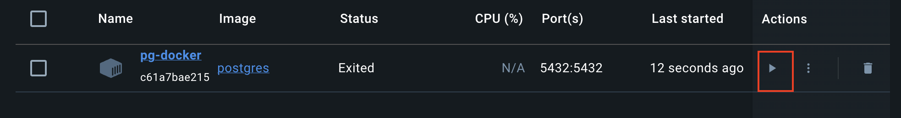

# Containers e Bancos de Dados

Até o momento nós utilizamos o SQLite para as nossas operações com bancos de dados. Já discutimos que ele não é adequado para um ambiente de produção. A instalação e configuração de um banco de dados costumava ser um processo bastante manual, mas esse processo se tornou muito mais simples com o surgimento dos containers. Os containers são um tipo de virtualização de sistema operacional através dos quais é possível termos um ambiente isolado e controlado que contém apenas o que precisamos para a nossa aplicação. De maneira geral, basta compartilhar os arquivos de configuração e outra pessoa (ou máquina) pode executar uma cópia exata do seu container em outro computador. Neste handout nós utilizaremos um container Docker que já possui o banco de dados PostgreSQL instalado.

!!! danger "Lição de Casa"
    Caso o sistema operacional que você utiliza é o Windows, era esperado que tivesse seguido o [Guia de Instalação WSL e Docker para Windows](https://github.com/InsperGuides/Guia-Instalacao-WSL-e-Docker---Windows){:target="_blank"} como lição de casa. 

    Esse guia não funcionará dentro da rede do Insper.

## Configuração inicial

Instale o Docker seguindo as instruções para o seu sistema operacional: [https://docs.docker.com/get-docker/](https://docs.docker.com/get-docker/){:target="_blank"}

- Agora vamos rodar alguns comandos no terminal.
- No terminal, não é necessário estar dentro de nenhum pasta específica.
- Para sistemas operacionais Windows e MacOS é necessário abrir a aplicação Docker Desktop para que o terminal reconheça os comandos do Docker.

1. Faça o download da imagem do Postgres (é a definição de um sistema com o Postgres instalado):

        docker pull postgres

    O Docker cria um ambiente isolado para o Postgres, então você não precisa se preocupar com a instalação do Postgres no seu sistema operacional.

    Caso o docker peça para logar, não é necessário fazer login no momento. 

    ??? danger "docker não é reconhecido no MacOs"
        Caso o terminal do MacOS não reconheça o comando `docker`, é necessário abrir a aplicação Docker Desktop. 
        Caso isso não resolva, é necessário adicionar o Docker ao PATH do terminal.
        Para isso, vá na pasta do seu usuário e procure pelo arquivo `.zprofile`, caso não encontre, tente o comando `Command + Shipt + .`.

        Abra o arquivo no editor de texto de sua preferência e adicione a linha abaixo no final do arquivo:

        ```bash
        export PATH="<Caminho de instalação do docker>:$PATH"
        ```

        Este caminho deve estar na pasta do seu usuário.

2. Crie uma pasta no seu computador para armazenar os dados do banco de dados (você pode criar em outro diretório se preferir). Se o seu sistema operacional for windows, rode este comando via terminal do PowerShell.

    === "Windows :material-microsoft-windows: CMD"
        ```bash
        mkdir %USERPROFILE%\docker\volumes\postgres
        ```
    === "Windows :material-microsoft-windows: PowerShell"
        ```bash
        New-Item -ItemType Directory -Force -Path $HOME\docker\volumes\postgres
        ```
    === "MacOS :material-apple:/Linux :simple-linux:"
        ```bash
        mkdir -p $HOME/docker/volumes/postgres
        ```

        

3. Execute o container. (**Obs.: Se você alterou o caminho dos diretórios na etapa anterior, você precisará atualizar o caminho no comando abaixo.**)
    O PostgreSQL é sistema de banco de dados que diferente do SQLite, é um sistema de banco de dados que precisa de um usuário e senha para acessar. 

    No comando abaixo estamos executando um container chamado `pg-docker` (você pode mudar o nome), com `escolhaumasenha` como a senha do administrador do banco de dados, na porta `5432` (é a porta padrão do Postgres) e a pasta que criamos no penúltimo comando será mapeada dentro do container como a pasta `/var/lib/postgresql/data`. O `postgres` no final do comando é o nome da imagem que vamos utilizar (que foi baixada no `docker pull postgres`).


        docker run --rm --name pg-docker -e POSTGRES_PASSWORD=escolhaumasenha -d -p 5432:5432 -v $HOME/docker/volumes/postgres:/var/lib/postgresql/data postgres


Você pode verificar se o container está rodando com o comando:

    docker ps

Você deve ver algo parecido com a imagem abaixo:  


Também é possível verificar o container ativo na aplicação desktop do docker:


## Configuração do banco de dados

Agora que a aplicação está rodando, vamos configurar o banco de dados. O Docker está executando um container, que é como se o seu sistema operacional estivesse executando outro sistema operacional dentro dele. Precisamos entrar no terminal do container para executar os comandos de configuração. Utilize o comando a seguir para entrar no terminal do container:

    docker exec -it pg-docker bash

O comando abaixo irá ativar o terminal para conseguirmos executar comando no banco de dados.
Dentro do terminal do container, execute o comando a seguir para iniciar a linha de comando do Postgres:

    psql -h localhost -U postgres

Agora, utilize os comandos a seguir para criar o banco de dados e o usuário que serão utilizados pela sua aplicação (algumas configurações a seguir são recomendadas pela [documentação do Django](https://docs.djangoproject.com/en/6.0/ref/databases/#optimizing-postgresql-s-configuration){:target="_blank"}):

    CREATE DATABASE getit;
    CREATE USER getituser WITH PASSWORD 'getitsenha';
    ALTER ROLE getituser SET client_encoding TO 'utf8';
    ALTER ROLE getituser SET default_transaction_isolation TO 'read committed';
    ALTER ROLE getituser SET timezone TO 'UTC';
    GRANT ALL PRIVILEGES ON DATABASE getit TO getituser;
    ALTER DATABASE getit OWNER TO getituser;
    \q

Para sair do terminal do container, utilize o comando `exit`.

Não é necessário se preocupar com os comandos acima, pois eles são apenas para configurar o banco de dados. O que é importante é que você entenda que o banco de dados está rodando em um ambiente isolado e que você precisa entrar nesse ambiente para executar alguns comandos. 

Basicamente, o que fizemos foi criar um banco de dados chamado `getit`, um usuário chamado `getituser` com a senha `getitsenha` e demos permissões para que esse usuário possa acessar o banco de dados. Esse usuário que criamos é o que será utilizado pela aplicação Django para que seja possível acessar o banco de dados. 

O outro usuário que criamos anteriormente, `postgres`, é o usuário administrador do banco de dados. Ele é o usuário que utilizamos para criar o banco de dados e o usuário que será utilizado para acessar o banco de dados no terminal do container.

## Configuração do Django

Agora vamos configurar o Django para que ele utilize o Postgres do nosso container ao invés do SQLite. Para isso será necessário instalar o módulo `psycopg2` (**não se esqueça de ativar o ambiente virtual antes**):

    pip install psycopg2

Se o comando acima não funcionar, tente este (ele [não é adequado para uso em produção](https://www.psycopg.org/docs/install.html)):

    pip install psycopg2-binary

Procure o código a seguir no arquivo `getit/settings.py` no seu projeto:

```python
DATABASES = {
    'default': {
        'ENGINE': 'django.db.backends.sqlite3',
        'NAME': BASE_DIR / 'db.sqlite3',
    }
}
```

Substitua esse dicionário por:

```python
DATABASES = {
    'default': {
        'ENGINE': 'django.db.backends.postgresql_psycopg2',
        'NAME': 'getit',
        'USER': 'getituser',
        'PASSWORD': 'getitsenha',
        'HOST': 'localhost',
        'PORT': '5432',
    }
}
```

Trocamos a configuração inicial do SQLite para a configuração do Postgres. Agora o Django irá utilizar o banco de dados que configuramos no container.

Pronto! Seu projeto Django está configurado para utilizar o Postgres!

## Novo banco de dados

Você está usando um novo banco de dados, portanto será necessário executar novamente os comandos `python manage.py migrate` para aplicar as migrações e `python manage.py createsuperuser` para criar o usuário administrador.

## Visualizando o banco de dados com o pgAdmin
Caso queira visualizar as tabelas criadas no banco de dados, será necessário instalar o [pgAdmin](https://www.pgadmin.org){:target="_blank"}. 

Veja o vídeo a seguir para aprender a instalar e configurar o pgAdmin para visualizar o banco de dados que está rodando no container:

<iframe width="560" height="315" src="https://www.youtube.com/embed/gEgRSS3Z8JQ?si=5vclwkCWUIH8vh-m" title="YouTube video player" frameborder="0" allow="accelerometer; autoplay; clipboard-write; encrypted-media; gyroscope; picture-in-picture; web-share" allowfullscreen></iframe>


## Desligando o container

Quando você não for trabalhar no projeto e desejar fechar o docker, rode o comando no terminal:
    docker kill pg-docker

Ou clique na opção *stop* que aparece ao lado do nome do container na aplicação desktop do docker:  


## Ligando o container

Quando você for trabalhar no projeto novamente, será necessário ligar o container com o comando utilizando no começo do handout:

    docker run --rm --name pg-docker -e POSTGRES_PASSWORD=escolhaumasenha -d -p 5432:5432 -v $HOME/docker/volumes/postgres:/var/lib/postgresql/data postgres

Caso se esqueça de ligar o container, você verá o erro abaixo ao tentar rodar o projeto:

```bash
django.db.utils.OperationalError: connection to server at "localhost" (127.0.0.1), port 5432 failed: Connection refused
        Is the server running on that host and accepting TCP/IP connections?
connection to server at "localhost" (::1), port 5432 failed: Connection refused
        Is the server running on that host and accepting TCP/IP connections?
```
    
Caso não queira rodar o comando acima toda vez que for trabalhar no projeto, você pode rodar o comando sem o argumento `-rm` e da próxima vez basta clicar no botão *start* na aplicação desktop do docker para ligar o container.
    
    docker run --name pg-docker -e POSTGRES_PASSWORD=escolhaumasenha -d -p 5432:5432 -v $HOME/docker/volumes/postgres:/var/lib/postgresql/data postgres

<figure markdown="span">
  { width="80%" }
</figure>


## Referências

- https://hackernoon.com/dont-install-postgres-docker-pull-postgres-bee20e200198
- https://www.digitalocean.com/community/tutorials/how-to-use-postgresql-with-your-django-application-on-ubuntu-16-04
- https://docs.djangoproject.com/en/4.1/ref/databases/#optimizing-postgresql-s-configuration
- https://www.youtube.com/watch?v=oQ08ZaOAiGU&t=119s
- https://docs.microsoft.com/en-us/windows/wsl/install-manual
