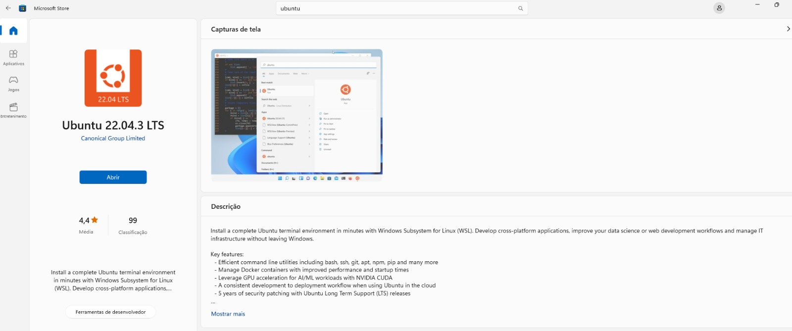
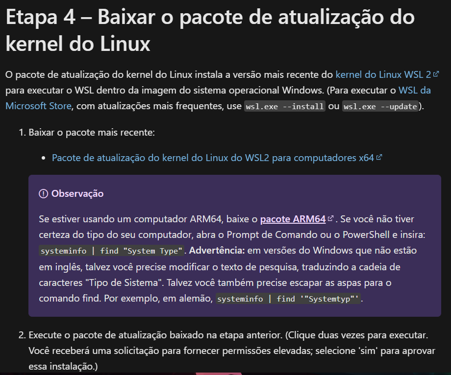
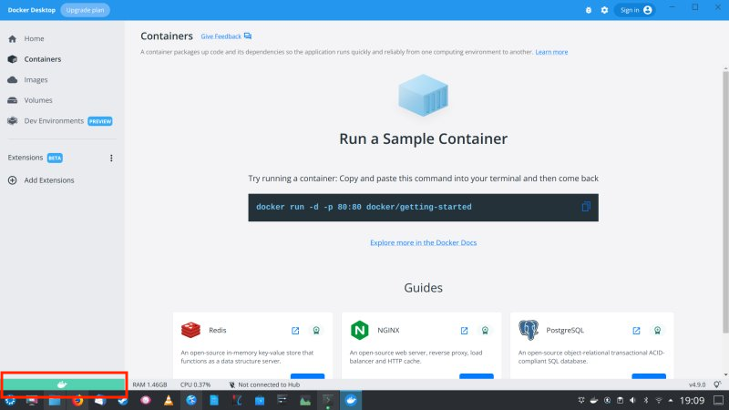

# Guia de instalação do WSL para Sistemas Operacionais Windows

- Acesse o aplicativo da Microsoft Store
- Busque por "Ubuntu" e clique em "Obter"

<figure markdown="span">
    { width="80%" }
</figure>

## Caso você encontre algum problema na instalação :tools:

O material abaixo foi disponibilizado pelo colega de vocês **Lucas Espina** que se deparou com um problema e documentou a solução para ajudar os colegas. 

Obrigada Lucas pela contribuição! :material-robot-happy-outline:

Após instalar o `WSL Ubuntu 22.0.4` ocorreu o seguinte erro: 

```
Installing, this may take a few minutes... WslRegisterDistribution failed with error: 0x8007019e Error: 0x8007019e O Subsistema do Windows para Linux nÒo foi habilitado.
```

Para contornar esse erro execute os seguintes comandos:

    dism.exe /online /enable-feature /featurename:Microsoft-Windows-Subsystem-Linux /all /norestart
    dism.exe /online /enable-feature /featurename:VirtualMachinePlatform /all /norestart

- Após isso é necessário reiniciar o computador;
- Ao tentar executar o Ubuntu pelo WSL é possível se deparar com o seguinte erro:

```
WslRegisterDistribution failed with error: 0x800701bc
Error: 0x800701bc WSL 2 requer uma atualizaþÒo para seu componente kernel. Para obter mais informaþ§es, visite https://aka.ms/wsl2kernel
```


- Acesse o link: [https://learn.microsoft.com/pt-br/windows/wsl/install-manual#step-4---download-the-linux-kernel-update-package](https://learn.microsoft.com/pt-br/windows/wsl/install-manual#step-4---download-the-linux-kernel-update-package){:target="_blank"}

- Baixe o `pacote de atualização do kernel do Linux do WSL2 para computadores x64`

<figure markdown="span">
    { width="60%" }
</figure>


## Instalação do Docker

Após instalar o WSL, é necessário instalar o Docker. Para isso, vá para o handout de [Docker](../05-bd.md)

!!! tip "Se tudo der certo ..."
    Se ao instalar o docker você se deparar com o status verde igual o da imagem a seguir, que dizer que tudo deu certo! 

    <figure markdown="span">
        { width="60%" }
    </figure>

    Caso contrário, siga as instruções deste outro guia: [Outro guia](../05-bd/windows_docker_install.md)
    