# Deploy da Aplicação

Até agora você desenvolveu as suas aplicações e testou o servidor localmente. Neste handout vamos aprender como publicar a nossa aplicação para que qualquer pessoa com acesso à internet possa acessá-la. Existem diversas opções de hospedagem disponíveis. Alguns exemplos são a [Amazon AWS](https://aws.amazon.com/){:target="_blank"}, [DigitalOcean](https://www.digitalocean.com/){:target="_blank"}, [PythonAnywhere](https://www.pythonanywhere.com/){:target="_blank"}, [Linode](https://www.linode.com/){:target="_blank"}, [Heroku](https://www.heroku.com/){:target="_blank"} ...


## Crie uma conta

Vamos utilizar o serviço [Render](https://render.com){:target="_blank"} que oferece a opção gratuita para testarmos o seu serviço.

<figure markdown="span">
    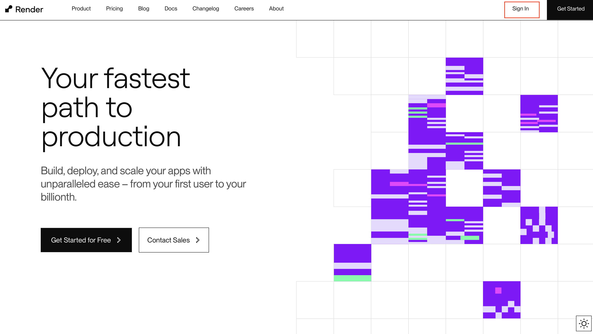{ width="70%" }
</figure>


Crie a conta utilizando a conta do Github.

<figure markdown="span">
    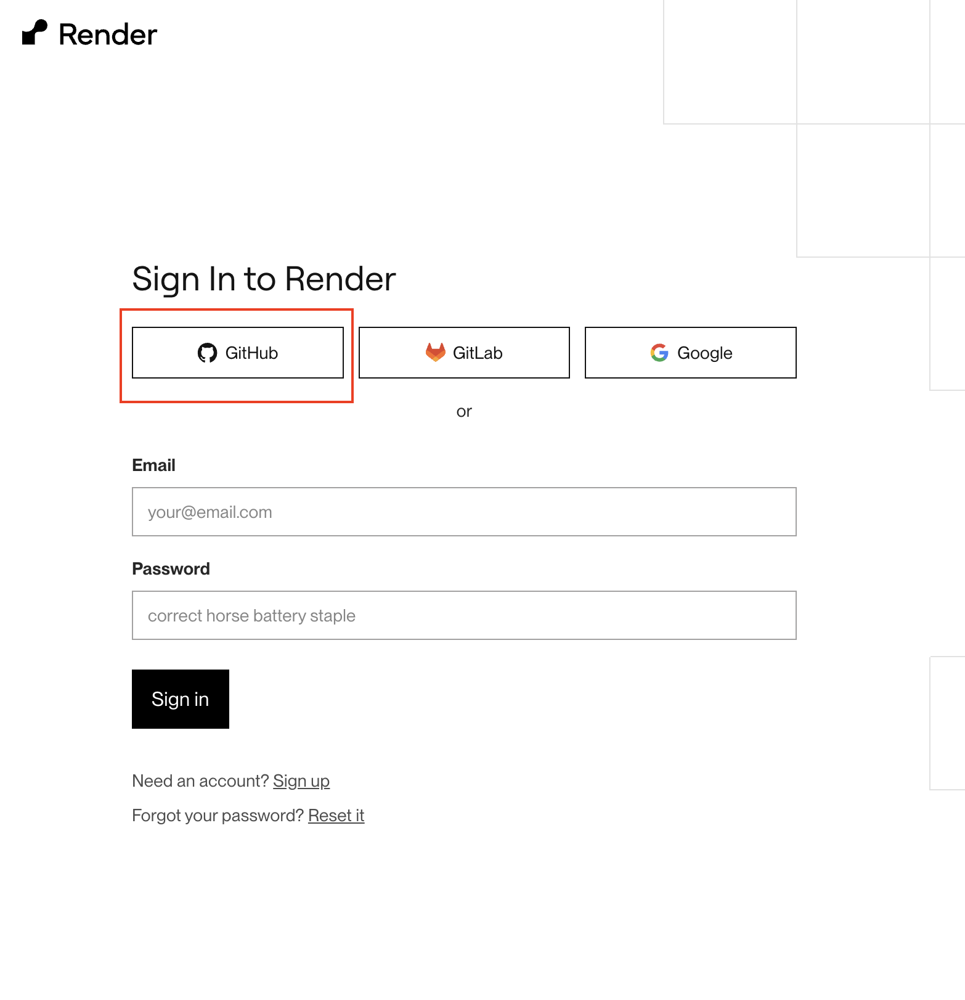{ width="60%" }
</figure>


!!! danger "Importante"
    Não adicione/cadastre nenhum informação de pagamento.

## Projeto Exemplo

Para este handout, vamos utilizar um projeto exemplo que está disponível no repositório: [https://github.com/BarbaraTieko/tecweb-projeto-exemplo.git](https://github.com/BarbaraTieko/tecweb-projeto-exemplo.git){:target="_blank"}

Acesse o link do repositório e faça um fork do projeto.
<figure markdown="span">
    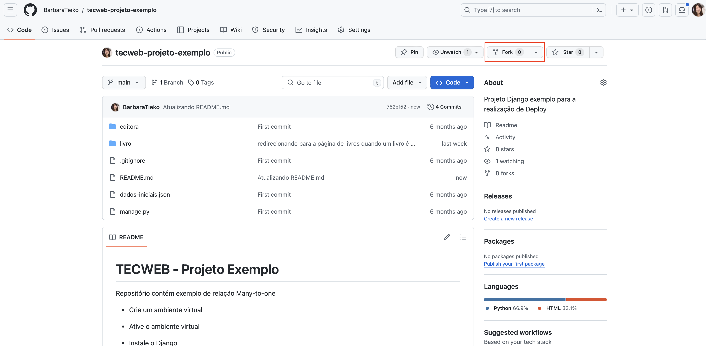{ width="80%" }
</figure>

Ao realizar o fork, você terá uma cópia do projeto em seu repositório. Desta forma, você poderá realizar as alterações que desejar sem alterar o projeto original.

<figure markdown="span">
    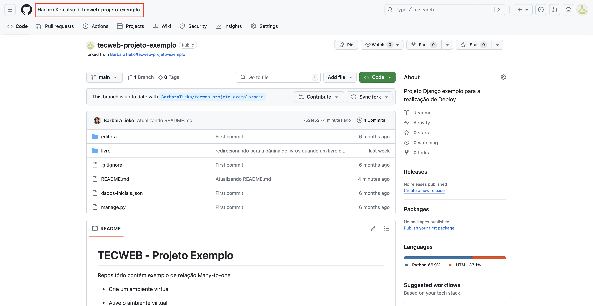{ width="80%" }
</figure>

Clone o repositório que acabou de criar com o fork.

## Criando PostgreSQL no Render

Atualmente estamos testando a aplicação localmente em nosso computador.

<figure markdown="span">
    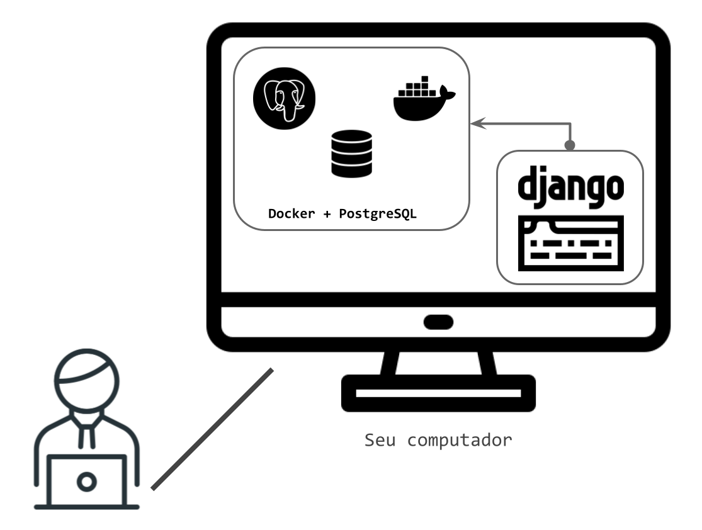{ width="60%" }
</figure>

Para que a aplicação fique disponível para qualquer pessoa com acesso à internet, precisamos deixar nossa aplicação rodando 24 horas por dia. O nosso computador não é a melhor opção para isso. Para isso, vamos pegar emprestado um computador de uma empresa que oferece esse serviço. Neste handout vamos utilizar o `Render` que oferece uma opção gratuita para testarmos o seu serviço.

O primeiro passo é criar um banco de dados PostgreSQL utilizando o Render. 

<figure markdown="span">
    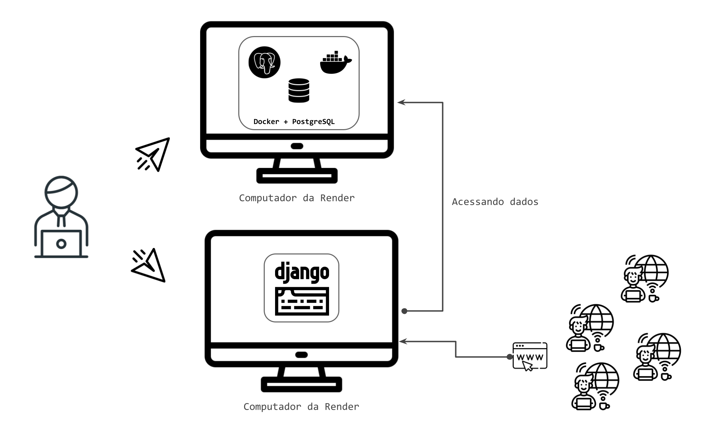{ width="80%" }
</figure>

Visite o site [https://render.com/](https://render.com/){:target="_blank"} e preenche o campo `name` com um nome para o banco de dados. Os outros campos são opcionais.

<figure markdown="span">
    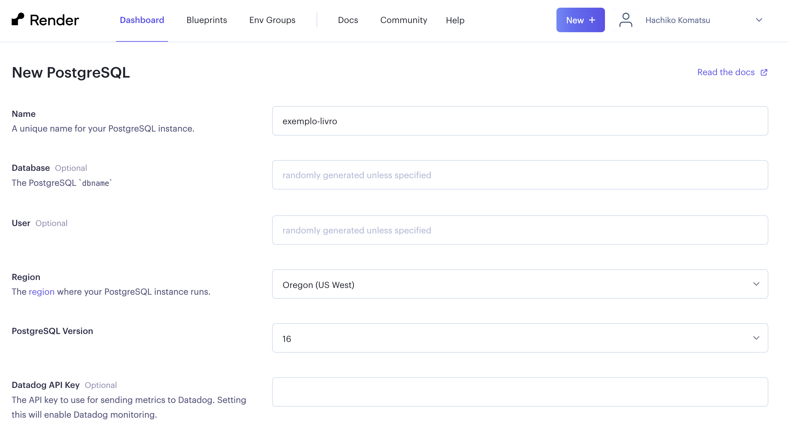{ width="80%" }
</figure>

Escolha a opção gratuita. Não é necessário adicionar nenhuma informação de pagamento.
Em seguida, clique em `Create Database`.

<figure markdown="span">
    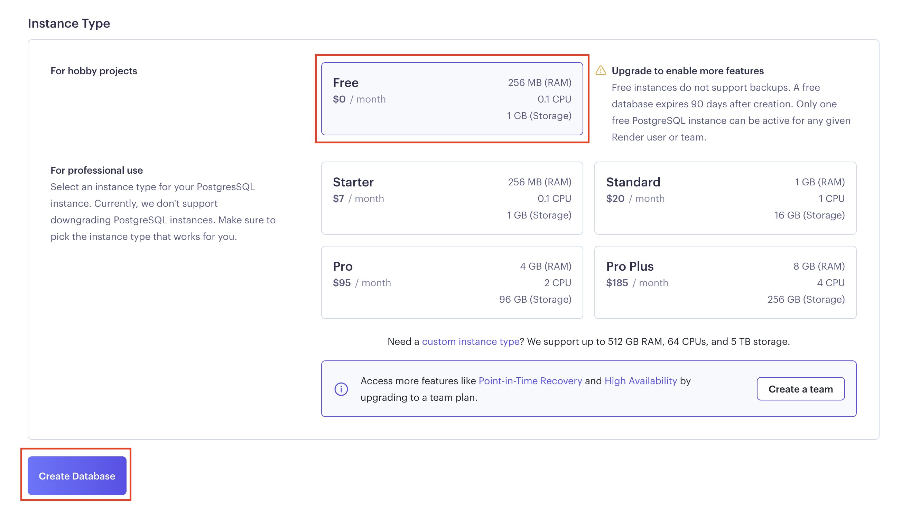{ width="80%" }
</figure>

Será necessário esperar um pouco até que o banco de dados seja criado.

<figure markdown="span">
    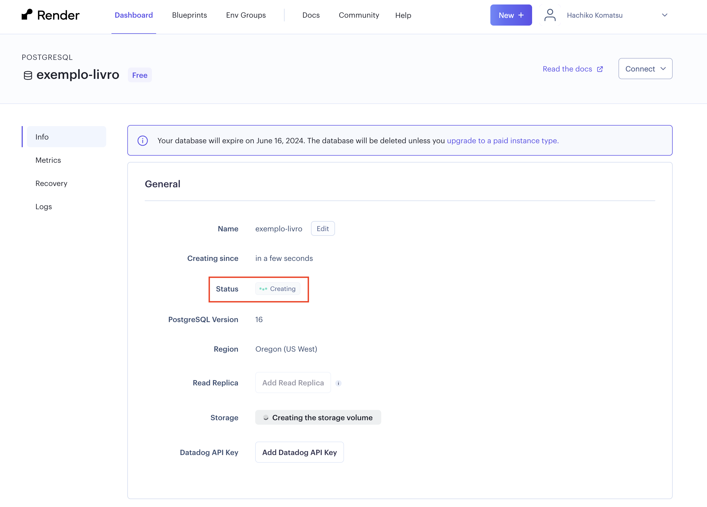{ width="80%" }
</figure>

Quando o `status` estiver como `Available`, desça a página e procure a área chamada `Connections`. Dentro dessa área, procure o campo `External Database URL`, essa informação será utilizada para conectar o banco de dados com a aplicação. 

Clique no botão `Copy` e guarde essa informação, pois vamos precisar dela mais tarde. 

<figure markdown="span">
    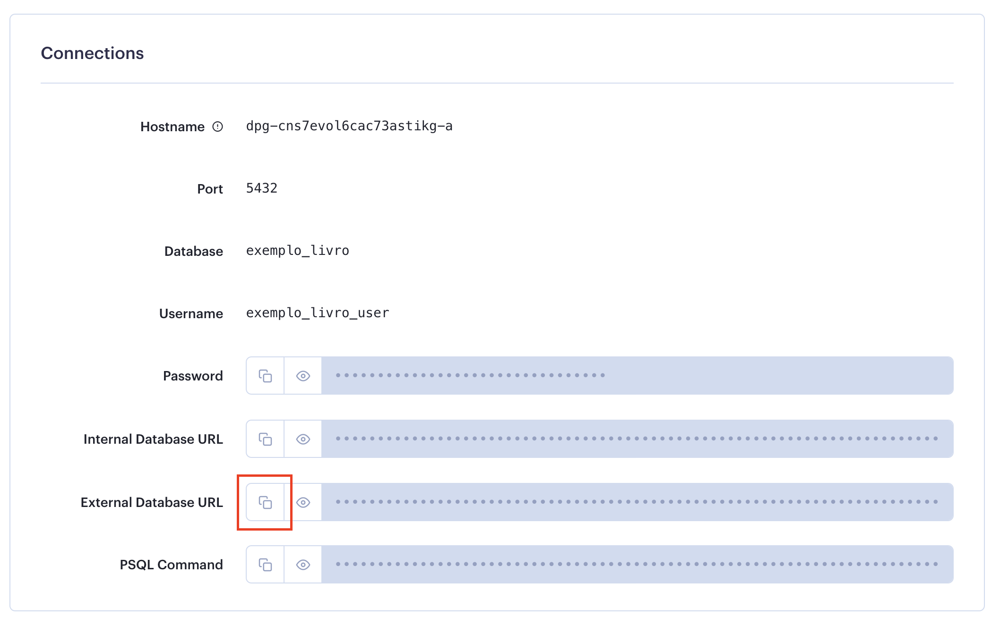{ width="80%" }
</figure>

## Conectando a aplicação com o banco de dados PostgreSQL

- Abra o projeto exemplo.
- Crie um ambiente virtual para este projeto e ative-o.
- No projeto há um arquivo chamado `requirements.txt` que contém todas as dependências necessárias para rodar o projeto. Vamos instalar todas as dependências com o comando:

    ```shell
    pip install -r requirements.txt
    ```

    !!! danger "Problema"
        Caso o comando acima não funcione, tente instalar as dependências a seguir:

        ```shell
        pip install django
        pip install psycopg2
        ```

    !!! tip "Projeto 1B"
        Para o projeto 1B não será necessário seguir esta etapa, pois o seu projeto ainda não possui um arquivo `requirements.txt`.

        Basta continuar com as próximas etapas.

- Para conectarmos a aplicação com o banco de dados PostgreSQL que acabamos de criar, vamos utilizar a biblioteca `dj-database-url`. Essa biblioteca é responsável por fazer a conexão entre a aplicação e o banco de dados. Para instalar essa biblioteca, execute o comando:

    ```shell
    pip install dj-database-url
    ```

    Sempre que você adiciona (ou remove) uma dependência é necessário atualizar o `requirements.txt`:
        ```shell
        pip freeze > requirements.txt
        ```

    Veja que o arquivo `requirements.txt` foi atualizado com a nova dependência.


- Adicione o `#!python import` no começo do arquivo `settings.py` (Pode ser logo após o código `#!python from pathlib import Path`):

```python
import dj_database_url
```

- ainda no arquivo `settings.py`, procure pelo dicionário `#!python DATABASES` e substitua pelo código abaixo:

```python
DATABASES = {
    'default': dj_database_url.config(
        default='',
        conn_max_age=600,
        ssl_require=not DEBUG
    )
}
```

No campo **default** adicione a informação aquela informação que havíamos copiado anteriormente. (O campo **External DATABASE URL**)

## Mais configurações do projeto

Até o momento, nós utilizamos o `python manage.py runserver` para executar o nosso servidor localmente. Esse comando é apropriado apenas para testes no ambiente de desenvolvimento. Ele não é otimizado para uma aplicação real. Para isso precisamos de um servidor de **Web Server Gateway Interface (WSGI)**, que basicamente é um intermediário entre as requisições que chegam no servidor e o código Python. No nosso projeto nós utilizaremos o [Gunicorn (Green Unicorn)](https://gunicorn.org/){:target="_blank"}. Você pode instalá-lo com (**importante:** lembre-se de ativar o ambiente virtual):

    pip install gunicorn

Será necessário atualizar o `requirements.txt`:
    ```shell
    pip freeze > requirements.txt
    ```

!!! info "O arquivo `wsgi.py`"
    O comando acima executou o Gunicorn com o arquivo de configuração `wsgi.py` que existe no projeto. Normalmente não é necessário alterar esse arquivo, então não vamos entrar em detalhes. O que você precisa saber é que todo projeto Django possui um arquivo `wsgi.py` dentro da pasta do projeto.

### Outras modificações nas configurações

Aproveite que está com o `settings.py` aberto e modifique o valor da constante `DEBUG` para `False`. Além disso, procure pela lista `ALLOWED_HOSTS`, ela deve ser uma lista vazia, ou seja, `ALLOWED_HOSTS = []` altere para:

```python
ALLOWED_HOSTS = ['*']
```

### Configurando os arquivos estáticos

Praticamente toda aplicação web possui arquivos estáticos. Desde o primeiro servidor que implementamos foi necessário que o servidor fosse capaz de responder com o conteúdo desses arquivos. Entretanto, passar pela camada do Python para devolver um arquivo estático não é uma boa estratégia para uma aplicação no mundo real. Arquivos estáticos podem ser servidos de maneira **muito** mais eficiente. Por esse motivo, o Django serve arquivos estáticos apenas em ambientes de teste/desenvolvimento, mas não em produção.

Para que a nossa aplicação funcione com todos os arquivos estáticos será necessário adicionarmos mais algumas dependências e alterarmos algumas configurações. Comece instalando o [WhiteNoise](http://whitenoise.evans.io/en/stable/){:target="_blank"}:

    pip install whitenoise

O WhiteNoise é responsável por servir arquivos estáticos no Django de forma eficiente. Ele precisa ser adicionado às configurações do Django. Abra o arquivo `settings.py` e procure pela lista chamada `MIDDLEWARE` e adicione o seguinte conteúdo logo depois de `'django.middleware.security.SecurityMiddleware',`:

    'whitenoise.middleware.WhiteNoiseMiddleware',

Nesse mesmo arquivo, procure por `STATIC_URL = '/static/'` e **adicione** a seguinte linha logo em seguida:

    STATIC_ROOT = BASE_DIR / 'staticfiles'

A primeira modificação faz com que o WhiteNoise seja utilizado pelo Django. A constante `STATIC_ROOT` define onde o Django deve colocar os arquivos estáticos que serão servidos em produção (por isso você não precisou dele até agora).

Como instalamos o `whitenoise` precisamos atualizar o `requirements.txt`. Desta forma, rode o comando abaixo novamente.

    pip freeze > requirements.txt

O arquivo `requirements.txt` deve se parecer com o exemplo abaixo:

<figure markdown="span">
    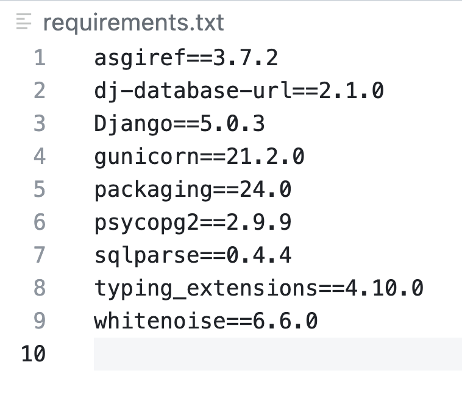{ width="40%" }
</figure>

Caso o arquivo `requirements.txt` possua muitas dependências, talvez você tenha se esquecido de utilizar o ambiente virtual. Neste caso, ative o ambiente virtual e rode o comando `pip freeze > requirements.txt` novamente.

Se o arquivo possuir muitas dependências desnecessárias o deploy vai falhar.

### Faça commit e um push
Faça o commit das mudanças do seu projeto e faça um push para o seu repositório no Github.

## Enviando o projeto para o Render

- Acesse a página do Render e clique em `New +` e em seguida `Web Service`.

    <figure markdown="span">
        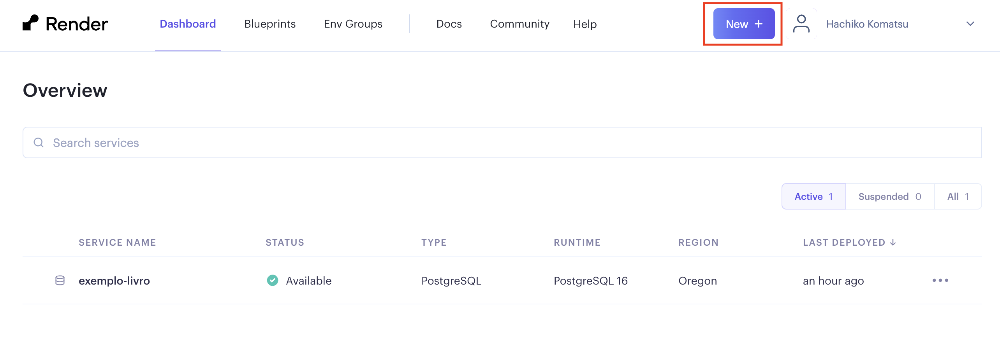{ width="80%" }
    </figure>

    <figure markdown="span">
        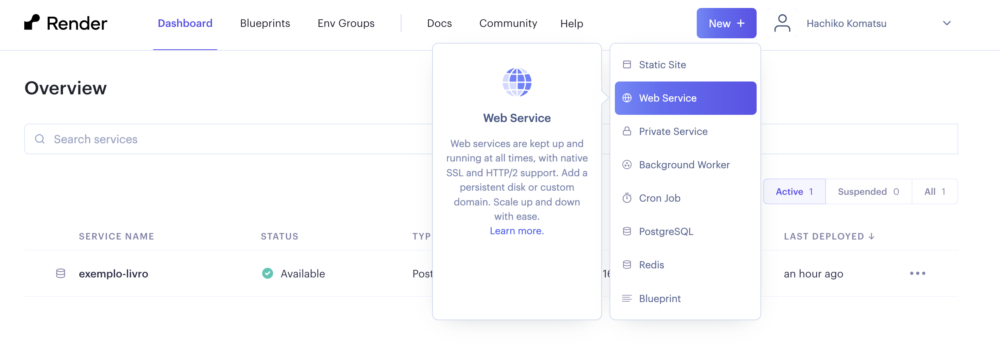{ width="80%" }
    </figure>

- Escolha a opção de fazer o deploy a partir de um repositório do Github.

    <figure markdown="span">
        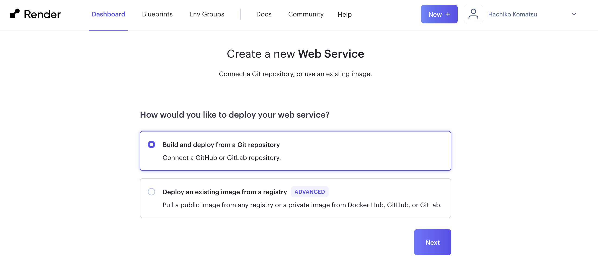{ width="80%" }
    </figure>

- Procure o repositório que você fez o fork do projeto e clique em `Connect`.

    <figure markdown="span">
        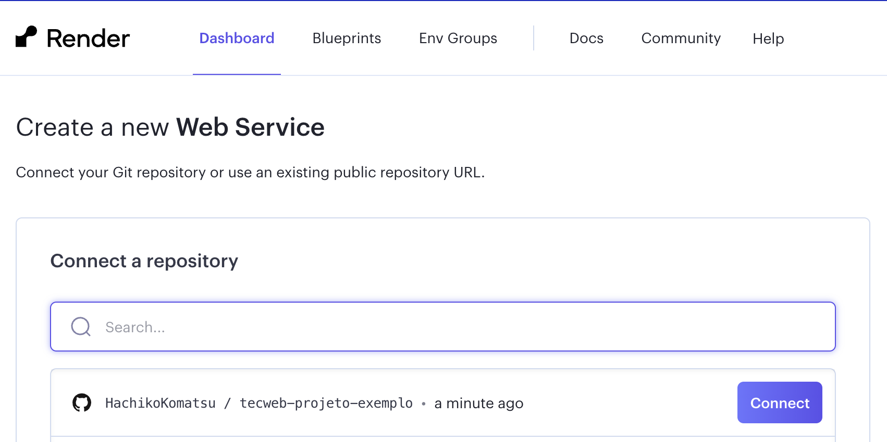{ width="80%" }
    </figure>

- Procure a opção `Start Command` e troque o comando existente pelo seguinte comando:

    ```shell
    python manage.py migrate && python manage.py collectstatic && gunicorn editora.wsgi:application
    ```

    <figure markdown="span">
        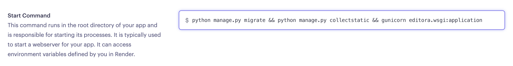{ width="80%" }
    </figure>

    Veja o que cada comando faz:

    - `python manage.py migrate` - Executa as migrações do banco de dados.
    - `python manage.py collectstatic` - Coleta todos os arquivos estáticos e os coloca na pasta `staticfiles`.
    - `gunicorn editora.wsgi:application` - Inicia o servidor com Gunicorn. Quando rodamos o comando `python manage.py runserver` o Django já inicia um servidor, mas para produção é necessário utilizar o Gunicorn.

    !!! danger "Importante"
        Ao tentar realizar este handout com o seu Projeto 1B, você deve alterar o comando `gunicorn editora.wsgi:application` para `gunicorn getit.wsgi:application`.

    Caso queira que alguns escritores sejam criados automaticamente, adicione o comando `python manage.py loaddata dados-iniciais.json`. Este comando irá carregar os dados do arquivo `dados-iniciais.json` para o banco de dados.
    ```shell
    python manage.py migrate && python manage.py loaddata dados-iniciais.json && python manage.py collectstatic && gunicorn editora.wsgi:application
    ```

- Selecione a opção gratuita e clique em `Create Web Service`.

    <figure markdown="span">
        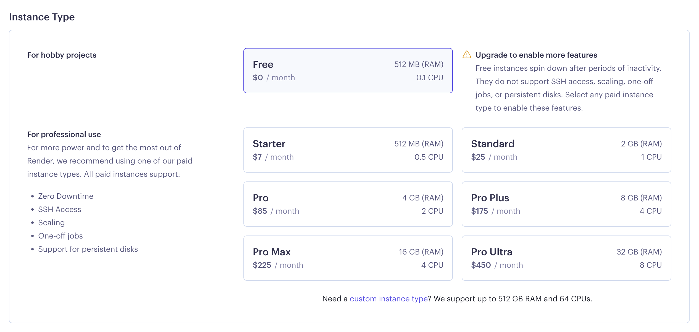{ width="80%" }
    </figure>
    
- O Render vai iniciar o processo de deploy. Aguarde até que o deploy seja finalizado. 
    É possível acompanhar o processo do deploy no terminal do Render. 

    <figure markdown="span">
        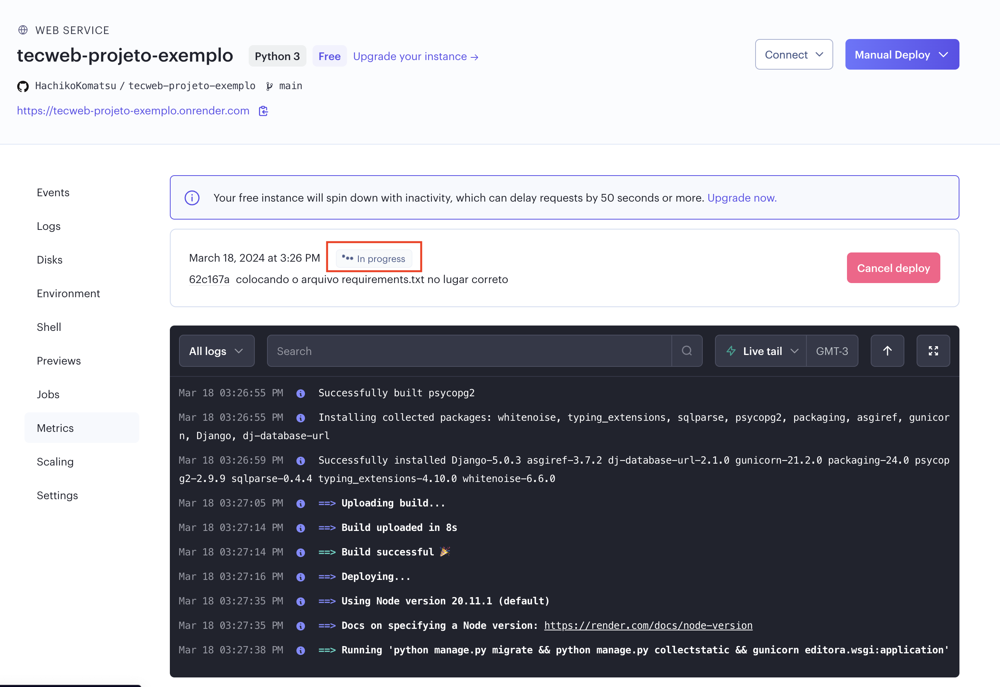{ width="80%" }
    </figure>

- Caso o deploy tenha sido realizado com sucesso, você verá a seguinte mensagem:

    <figure markdown="span">
        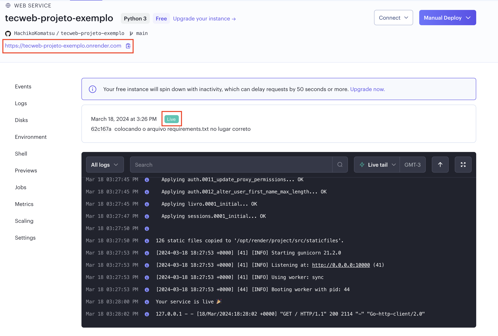{ width="80%" }
    </figure>

    É possível acessar a aplicação clicando no link que aparece no topo da página.


## Passo final

Após realizar a etapa acima com sucesso, realize as últimas configurações.

Vá no arquivo `settings.py` e atualize a variável `ALLOWED_HOSTS` (A configuração da variável `ALLOWED_HOSTS` serve para evitar alguns ataques):

```python
ALLOWED_HOSTS = ['tecweb-projeto-exemplo.onrender.com', 'localhost', '127.0.0.1', '0.0.0.0']
```
**Importante:** Para `ALLOWED_HOSTS` **não** deve utilizar o `https://`

Substitua `tecweb-projeto-exemplo.onrender.com` pelo link da sua aplicação gerado pelo Render.

Faça um novo commit e realize um push para o seu repositório no Github.

Sempre que você realizar um commit na branch principal, o Render fará um novo deploy.

<figure markdown="span">
    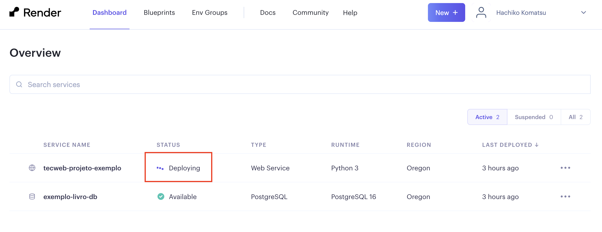{ width="80%" }
</figure>

<figure markdown="span">
    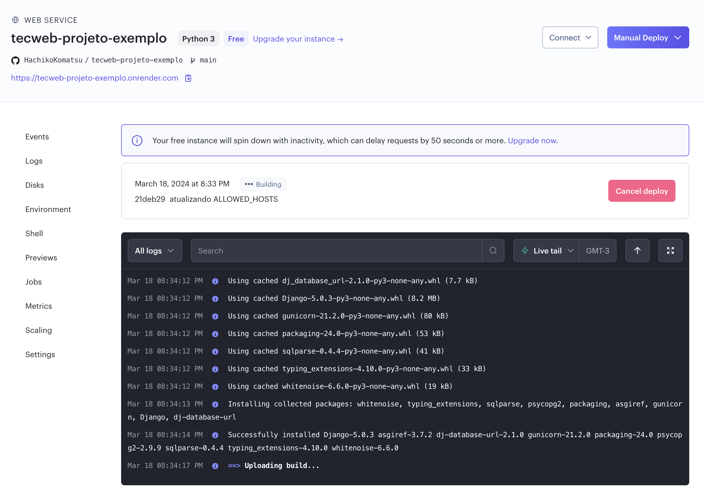{ width="80%" }
</figure>

## Rodando o projeto localmente

Agora que o nosso projeto está rodando no Render, não podemos fazer um commit de uma implementação não finalizada. Desta forma, sempre que precisar implementar uma nova funcionalidade, crie uma nova branch e faça um merge com a branch principal somente quando a funcionalidade estiver funcionando e finalizada.

Para implementar novas funcionalidades, será necessário rodar o projeto localmente novamente.

Para rodar o projeto localmente, mude a variável `Debug` presente no arquivo `settings.py` para `#!python True`.

Além disso, mude as configurações do banco de dados para uma das configurações abaixo:

Configuração para utilizar SQlite3:

```python
DATABASES = {
    'default': {
        'ENGINE': 'django.db.backends.sqlite3',
        'NAME': BASE_DIR / 'db.sqlite3',
    }
}
```

Configuração para utilizar PostgreSQL:

```python
DATABASES = {
    'default': {
        'ENGINE': 'django.db.backends.postgresql_psycopg2',
        'NAME': 'getit',
        'USER': 'getituser',
        'PASSWORD': 'getitsenha',
        'HOST': 'localhost',
        'PORT': '5432',
    }
}
```

!!! info "Config do banco de dados"
    Caso rode o projeto localmente e mantenha a configuração do banco de dados abaixo, você estará alterando o banco de dados que está no Render.com.
    
    ```python
    DATABASES = {
        'default': dj_database_url.config(
            default='',
            conn_max_age=600,
            ssl_require=not DEBUG
        )
    }
    ```

    Qualquer teste que for feito localmente estará alterando o banco de dados que está no render.com

!!! example "Fazendo o deploy do Projeto 1B"
    Agora que você finalizou o deploy do projeto exemplo, faça o deploy do Projeto 1B.

    Como o serviço do Render é gratuito, talvez tenha que excluir as instâncias do banco de dados e do projeto da editora de livros que acabou de criar para que possa criar novas instâncias para o Projeto 1B.

## Referências

- Deploying to Heroku Server | Django (3.0) Crash Course Tutorials (pt 23): https://www.youtube.com/watch?v=kBwhtEIXGII
- Deploy a Django App to Heroku: https://www.youtube.com/watch?v=GMbVzl_aLxM
- Heroku Postgres - connecting with Django: https://devcenter.heroku.com/articles/heroku-postgresql#connecting-with-django
- Heroku - Django migrations: https://help.heroku.com/GDQ74SU2/django-migrations
- Heroku - Working with Django: https://devcenter.heroku.com/categories/working-with-django
- Deploy a Django web app to a Render live server with PostgreSQL - https://youtu.be/AgTr5mw4zdI?si=DNWuSTXZEu92XHZR
- Deploy Django com PostgreSQL - utilizando Free Trial Render https://youtu.be/hJuQb5L1Eq0
