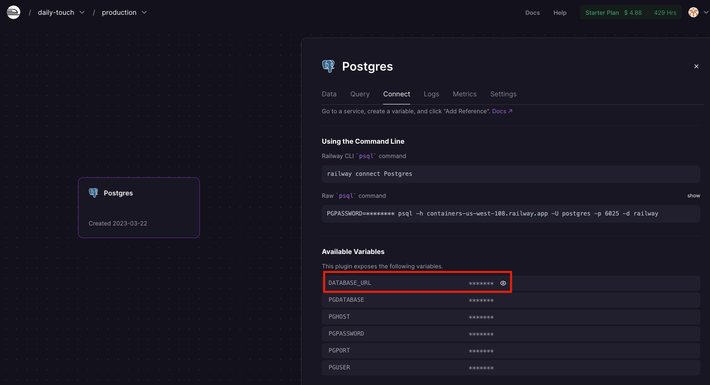
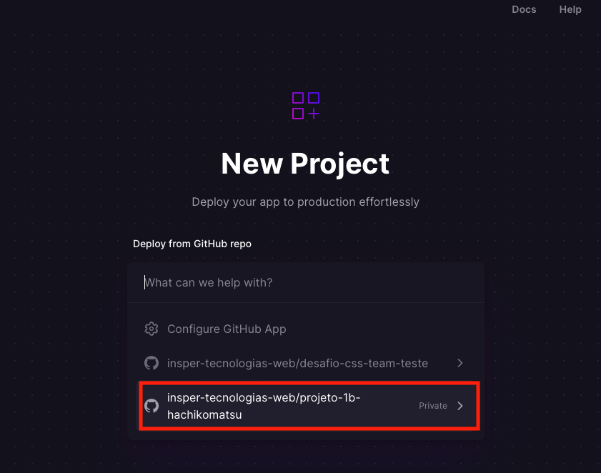

# Deploy da Aplicação

Até agora você desenvolveu as suas aplicações e testou o servidor localmente. Neste handout vamos aprender como publicar a nossa aplicação para que qualquer pessoa com acesso à internet possa acessá-la. Existem diversas opções de hospedagem disponíveis. Alguns exemplos são a [Amazon AWS](https://aws.amazon.com/), [DigitalOcean](https://www.digitalocean.com/), [PythonAnywhere](https://www.pythonanywhere.com/), [Linode](https://www.linode.com/), [Heroku](https://www.heroku.com/) ...

Para o projeto 1B vamos ver uma outra opções para fazer deploy. Lembrando que não há restrição para qual serviço devem utilizar. Estejam livres para utilizar o que preferirem.

!!! tip "Vídeo"
    Vídeo com algumas instruções para fazer o deploy: [https://www.youtube.com/watch?v=D58ug70Em8g](https://www.youtube.com/watch?v=D58ug70Em8g){:target="_blank"}

# Crie uma conta

Vamos utilizar o serviço [Railway](https://railway.app) que oferece um valor de $5 dólares para que possamos testar o serviço e o que é suficiente para o nosso projeto.

Veja o [Vídeo](https://www.youtube.com/watch?v=D58ug70Em8g){:target="_blank"} até a duração de `0:50` para criar a conta.

!!! danger "Importante"
    Não adicione/cadastre nenhum informação de pagamento.

### Aplicações com Postgres

Para a configuração do banco de dados, siga os passos descritos no [vídeo](https://youtu.be/D58ug70Em8g?t=50){:target="_blank"} a partir do tempo `0:50` até `1:17`.

Em seguida faça as alterações abaixo em seu projeto no projeto.

Vamos instalar o `dj-database-url`:

    pip install dj-database-url

Sempre que você adiciona (ou remove) uma dependência é necessário atualizar o `requirements.txt`:

    pip freeze > requirements.txt

Adicione o `#!python import` no `settings.py`:

```python
import dj_database_url
```

Depois substitua o dicionário `#!python DATABASES` pelo código abaixo:

```python
DATABASES = {
    'default': dj_database_url.config(
        default='',
        conn_max_age=600,
        ssl_require=not DEBUG
    )
}
```

No campo **default** adicione a informação que apresentada no Postgres do Railway, campo **DATABASE URL**.



## Configurando o projeto

!!! danger "Importante"
    Seu projeto deve estar no git. Se não estiver, crie um repositório antes de seguir para os próximos passos deste handout.

    Quando for criar o repositório, adicione um arquivo chamado `.gitignore` com o seguinte conteúdo:

    ```
    env/
    *.egg-info
    *.pot
    *.py[co]
    .tox/
    __pycache__
    MANIFEST
    dist/
    docs/_build/
    docs/locale/
    node_modules/
    tests/coverage_html/
    tests/.coverage
    build/
    tests/report/
    ```

!!! danger "Importante 2"
    O projeto Django deve estar na raiz do repositório github.
    ```
    > REPOSITÓRIO GIT
        > getit
        > notes
        manage.py
        requirements.txt
    ```

Até o momento, nós utilizamos o `python manage.py runserver` para executar o nosso servidor localmente. Esse comando é apropriado apenas para testes no ambiente de desenvolvimento. Ele não é otimizado para uma aplicação real. Para isso precisamos de um servidor de **Web Server Gateway Interface (WSGI)**, que basicamente é um intermediário entre as requisições que chegam no servidor e o código Python. No nosso projeto nós utilizaremos o [Gunicorn (Green Unicorn)](https://gunicorn.org/). Você pode instalá-lo com (**importante:** lembre-se de ativar o ambiente virtual):

    pip install gunicorn

!!! info "O arquivo `wsgi.py`"
    O comando acima executou o Gunicorn com o arquivo de configuração `getit/wsgi.py`. Normalmente não é necessário alterar esse arquivo, então não vamos entrar em detalhes. O que você precisa saber é que todo projeto Django possui um arquivo `wsgi.py` dentro da pasta do projeto.

Agora vamos definir o arquivo de configuração. Crie um arquivo chamado `Procfile` (o nome do arquivo não deve ter extensão nenhuma - cuidado se for criar o arquivo em algum editor de texto, pois alguns colocam o `.txt` automaticamente) na raiz do projeto com o seguinte conteúdo:

```
release: python manage.py migrate && python manage.py collectstatic
web: gunicorn getit.wsgi
```

A primeira linha faz com que o comando de migração do Django seja executado quando o servidor for carregado. A segunda linha especifica como a aplicação deve ser executada.


### Outras modificações nas configurações

Aproveite que está com o `settings.py` aberto e modifique o valor da constante `DEBUG` para `False`. Além disso, procure pela lista `ALLOWED_HOSTS`. Ela deve ser uma lista vazia.

```python
ALLOWED_HOSTS = ['*']
```

### Criando o arquivo `requirements.txt`

Vamos gerar o `requirements.txt`

    pip freeze > requirements.txt

!!! danger "Importante"
    Note que você deverá executar o comando `pip freeze > requirements.txt` com o ambiente virtual ativado. Após rodar o comando verifique o arquivo `requirements.txt` que foi criado. Este arquivo deve possuir no máximo 10 linhas. Se esse arquivo possuir muito mais linhas é possível que você não rodou com ambiente virtual ativo.

Abra o arquivo `requirements.txt` e altere a linha contendo `psycopg2==X.X.X` por `psycopg2-binary==X.X.X`. Mantenha a versão já existente.

### Configurando os arquivos estáticos

Praticamente toda aplicação web possui arquivos estáticos. Desde o primeiro servidor que implementamos foi necessário que o servidor fosse capaz de responder com o conteúdo desses arquivos. Entretanto, passar pela camada do Python para devolver um arquivo estático não é uma boa estratégia para uma aplicação no mundo real. Arquivos estáticos podem ser servidos de maneira **muito** mais eficiente. Por esse motivo, o Django serve arquivos estáticos apenas em ambientes de teste/desenvolvimento, mas não em produção.

Para que a nossa aplicação funcione com todos os arquivos estáticos será necessário adicionarmos mais algumas dependências e alterarmos algumas configurações. Comece instalando o [WhiteNoise](http://whitenoise.evans.io/en/stable/):

    pip install whitenoise

O WhiteNoise é responsável por servir arquivos estáticos no Django de forma eficiente. Ele precisa ser adicionado às configurações do Django. Abra o arquivo `getit/settings.py` e procure pela lista `MIDDLEWARE` e adicione o seguinte conteúdo logo depois de `'django.middleware.security.SecurityMiddleware',`:

    'whitenoise.middleware.WhiteNoiseMiddleware',

Nesse mesmo arquivo, procure por `STATIC_URL = '/static/'` e adicione a seguinte linha logo em seguida:

    STATIC_ROOT = BASE_DIR / 'staticfiles'

A primeira modificação faz com que o WhiteNoise seja utilizado pelo Django. A constante `STATIC_ROOT` define onde o Django deve colocar os arquivos estáticos que serão servidos em produção (por isso você não precisou dele até agora).

Como instalamos o `whitenoise` precisamos atualizar o `requirements.txt`. Desta forma, rode o comando abaixo novamente.

    pip freeze > requirements.txt

### Faça commit

Faça o commit das mudanças do seu projeto.

### Adicionando projeto no Railway

Vá no site do Railway para escolher o repositório github do projeto para fazer o deploy. Para mais detalhes veja o [vídeo](https://youtu.be/D58ug70Em8g?t=252){:target="_blank"}.

!!! dange "Importante"
    Diferente do vídeo, você deve escolher o repositório com o nome `insper-tecnologias-web/{O NOME DO SEU REPOSITÓRIO}`

    Será algo parecido com a imagem abaixo:
    

## Passo final

Após realizar a etapa acima com sucesso, realize as últimas configurações.

Vá no arquivo `settings.py` e atualize a variável `ALLOWED_HOSTS`:

```python
ALLOWED_HOSTS = ['web-production-a9f3.up.railway.app','localhost', '127.0.0.1']
```
**Importante:** Para `ALLOWED_HOSTS` **não** deve utilizar o `https://`

Substitua `web-production-a9f3.up.railway.app` pelo link da sua aplicação gerado pelo Railway.

Adicione na linha seguinte:
```python
CSRF_TRUSTED_ORIGINS = ['https://web-production-a9f3.up.railway.app']
```

Trocando também o link `https://web-production-a9f3.up.railway.app` pelo link da sua aplicação.

**Importante:** Para `CSRF_TRUSTED_ORIGINS` deve-se manter o `https://`

## Rodando o projeto localmente

Para rodar o projeto localmente, mude a variável `Debug` presente no arquivo `settings.py` para `#!python True`.

Além disso, mude as configurações do banco de dados para uma das configurações abaixo:

Configuração para utilizar SQlite3:

```python
DATABASES = {
    'default': {
        'ENGINE': 'django.db.backends.sqlite3',
        'NAME': BASE_DIR / 'db.sqlite3',
    }
}
```

Configuração para utilizar PostgreSQL:

```python
DATABASES = {
    'default': {
        'ENGINE': 'django.db.backends.postgresql_psycopg2',
        'NAME': 'getit',
        'USER': 'getituser',
        'PASSWORD': 'getitsenha',
        'HOST': 'localhost',
        'PORT': '5432',
    }
}
```

Caso utilize a configuração abaixo:
```python
DATABASES = {
    'default': dj_database_url.config(
        default='',
        conn_max_age=600,
        ssl_require=not DEBUG
    )
}
```

Qualquer teste que for feito localmente estará alterando o banco de dados que está no render.com

Sempre que você commitar mudanças no repositório Github na branch principal, o Railway fará um novo deploy.

O ideal seria criar uma branch nova para implementar novas funcionalidades e fazer um merge com a branch main somente quando a funcionalidade estiver funcionando e finalizada.

## Referências

- Deploying to Heroku Server | Django (3.0) Crash Course Tutorials (pt 23): https://www.youtube.com/watch?v=kBwhtEIXGII
- Deploy a Django App to Heroku: https://www.youtube.com/watch?v=GMbVzl_aLxM
- Heroku Postgres - connecting with Django: https://devcenter.heroku.com/articles/heroku-postgresql#connecting-with-django
- Heroku - Django migrations: https://help.heroku.com/GDQ74SU2/django-migrations
- Heroku - Working with Django: https://devcenter.heroku.com/categories/working-with-django
