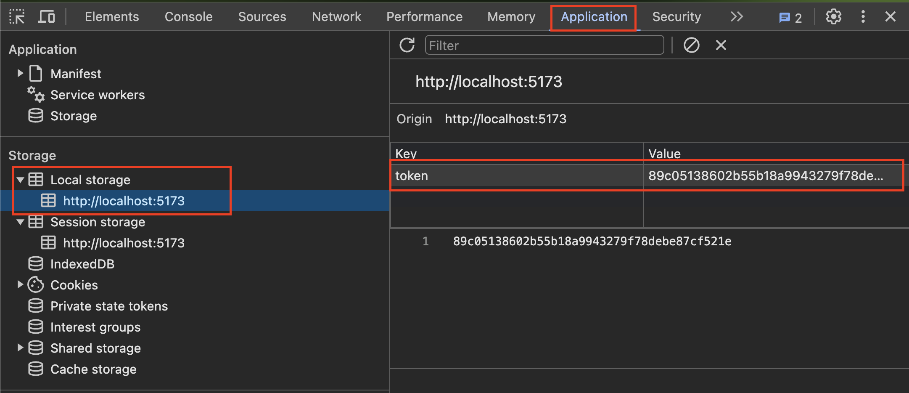

Depois de realizar o handout de autenticação no Django REST, vamos implementar a autenticação no frontend. 

Para seguir esta etapa, é necessário ter finalizado as etapas anteriores.

Vamos criar um componente `Login` para realizar a autenticação do usuário. Crie um arquivo `src/componentes/Login/index.jsx`:

!!! example "EXERCÍCIO"
    A partir do código abaixo, finalize a implementação do componente `Login` para realizar a autenticação do usuário.

```jsx
import { useState } from 'react';
import axios from 'axios';
import './style.css';

export default function Login() {
    const login = (event) => {
        event.preventDefault();
        //TODO: Aqui é com você! Faça a requisição para o backend para a rota api/token/
        // O retorno da requisição deve ser um token 
    }

    return (
        <div className="login-wrapper">
            <h1>Please Log In</h1>
            <form onSubmit={login}>
                <label>
                    <p>Username</p>
                    <input type="text" />
                </label>
                <label>
                    <p>Password</p>
                    <input type="password" />
                </label>
                <div>
                    <button type="submit">Submit</button>
                </div>
            </form>
        </div>
    )
}
```

A requisicão para a rota `api/token/` deve ser feita utilizando o método `POST` e o corpo da requisição deve conter o `username` e `password` do usuário.

Você deve ter chegador em algo parecido com isso para a função `login`:

```jsx
axios
  .post('http://localhost:8000/api/token/', data)
  .then((response) => {
      const token = response.data.token;
  })
```

Vamos armazenar o token no `localStorage` para utilizá-lo nas próximas requisições. 

!!! danger "Atenção"
    Armanezar o token no `localStorage` não é a melhor prática de segurança, pois o token ficará disponível para qualquer script que rodar no navegador. Neste handout, estamos utilizando o `localStorage` apenas para fins didáticos e para simplificar a implementação.

    Caso você esteja desenvolvendo uma aplicação real, considere utilizar outras formas de armazenamento de token, como useContext ou Redux.

O `localStorage` é um objeto que armazena dados no navegador do usuário. De forma similar, podemos utilizar o `sessionStorage` que armazena os dados apenas enquanto a sessão do navegador estiver aberta.

Para armazenar o token no `localStorage`, utilize o método `setItem`:

```jsx
axios
  .post('http://localhost:8000/api/token/', data)
  .then((response) => {
      const token = response.data.token;
      localStorage.setItem('token', token);
  })
```

Para que possamos testar, adicione uma nova rota no arquivo `main.jsx`:

```jsx
import React, { useContext } from 'react';
import ReactDOM from 'react-dom/client';
import {
  createBrowserRouter,
  RouterProvider,
} from "react-router-dom";
import App from './App.jsx';
import Editar, { loader as noteLoader} from './components/Editar';
import Login from './components/Login';
import './index.css';

const router = createBrowserRouter([
  {
    path: "/",
    element: <App />,
  },
  {
    path: "edit/:noteId",
    element: <Editar />,
    loader: noteLoader,
  },
  {
    path: "/login",
    element: <Login />,
  },
]);

ReactDOM.createRoot(document.getElementById('root')).render(
  <React.StrictMode>
    <RouterProvider router={router} />
  </React.StrictMode>,
);
```

Agora, ao acessar a rota `/login`, você deve ver o formulário de login.

Após tentar realizar o login, é possível verificar se o token foi armazenado no `localStorage` acessando o console do navegador e digitando `localStorage.getItem('token')`.

Ou acessando a aba `Application` no `DevTools` do navegador.

<figure markdown="span">
    { width="70%" }
</figure>

Após realizar a autenticação, vamos redirecionar o usuário para a página principal da aplicação.

Para isso, vamos utilizar o `useNavigate` do `react-router-dom`. 

```jsx hl_lines="2 7 21"
import { useState } from 'react';
import { useNavigate } from 'react-router-dom';

export default function Login() {
    const [username, setUsername] = useState('');
    const [password, setPassword] = useState('');
    const navigate = useNavigate();

    const login = (event) => {
        event.preventDefault();

        const data = {
            username: username,
            password: password,
        }
        axios
            .post('http://localhost:8000/api/token/', data)
            .then((response) => {
                const token = response.data.token;
                localStorage.setItem('token', token);
                navigate('/');
            })
    }
    // Restante do código
```

Agora, ao realizar o login, o usuário será redirecionado para a página principal da aplicação.

Na página principal, há a requisição para a rota `api/notes/` que necessita do token para ser realizada.

Agora que temos o token armazenado no `localStorage`, podemos utilizá-lo para realizar a requisição.

```jsx hl_lines="1 6 9-13 16 21-24"
import { useNavigate } from "react-router-dom";

// Restante do código

function App() {
  const navigate = useNavigate();
  const [notes, setNotes] = useState([]);

  const config = {
    headers: {
      Authorization: `token ${localStorage.getItem("token")}`,
    },
  };
  const carregaNotas = () => {
    axios
      .get("http://127.0.0.1:8000/api/notes/", config)
      .then((res) => setNotes(res.data));
  }

  useEffect(() => {
    if (localStorage.getItem("token") === null) {
      navigate("/login");
    }
    else {
        carregaNotas();
    }
  }, []);

  // Restante do código
```

No código acima, estamos passando o token no cabeçalho da requisição para a rota `api/notes/` para que o backend possa identificar o usuário autenticado e retornar somente as notas do usuário autenticado.

Além disso, adicinaos uma verificação para redirecionar o usuário para a página de login caso o token não esteja armazenado no `localStorage`.

Agora é com você! Implemente a página de cadastro de usuário e a funcionalidade de logout.
