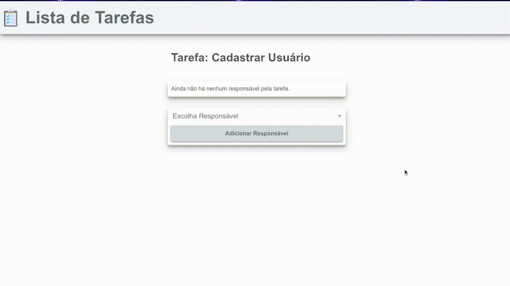
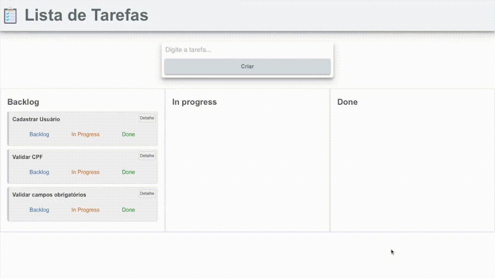

# Quadro Scrum

Você foi contratad@ para finalizar um projeto de Quadro Scrum. O objetivo deste projeto é possibilitar a criação de tarefas e vincular responsáveis para as tarefas.
O sistema já possui algumas funcionalidades implementadas. Nas questões abaixo você receberá instruções do que falta ser implementado para concluirmos o MVP.

## Configuração

Antes de iniciar a prova, execute os comandos abaixo no terminal (na pasta do exercício) para criar o banco de dados com os dados iniciais:

1. Baixe o projeto base para este exercício [Baixar Arquivos](desafio-django.zip)
1. Vá até a pasta do projeto:
    - `cd desafio-django`
2. Crie o banco de dados e adicione os dados iniciais:

    ```bash
    python manage.py migrate
    python manage.py loaddata dados-iniciais.json
    ```

## Básico (C)

Para o nível básico, você deve implementar ou corrigir as funcionalidades abaixo.

1. A página inicial deveria listar tarefas na seção de **Backlog**. Descubra o motivo por trás deste comportamento e faça as modificações necessárias para que as tarefas sejam apresentadas na página.

2. Cada tarefa possui um botão chamado **Detalhe** que deveria levar para outra página com os detalhes da tarefa. Atualmente o botão não faz nada, porém, a função `detalhe` e a url já foram criadas, basta fazer as modificações necessárias no botão `Detalhe` para finalizar a funcionalidade de visualizar os detalhes da tarefa.

3. Ao tentar criar uma tarefa nova utilizando o formulário, obtemos o seguinte erro **Forbidden CSRF verification failed. Request aborted**. Descubra o motiva por trás deste comportamento e faça as modificações necessárias.

4. Depois de consertar o erro que estava ocorrendo da etapa anterior, podemos tentar criar uma nova tarefa. Porém, a tarefa não está sendo criada. Descubra o que está faltando ara criar novas tarefas e faça as modificações necessárias para que seja possível criar novas tarefas.

## Proficiente (B)

Para o nível proficiente, você deve implementar as funcionalidades listadas abaixo.

1. **Adicionando Responsável:** Além de criar tarefas, o sistema também deve ser capaz de adicionar responsáveis pela tarefa. Para vincular uma pessoa a uma tarefa, vamos utilizar o modelo **ResponsavelDaTarefa** que possui duas chaves estrangeiras uma para tarefa e outra para pessoa.

    Faça as modificações necessárias para que seja possível adicionar uma pessoa a uma tarefa. Note que o formulário já existe no template.

2. Agora que é possível adicionar uma pessoa a uma tarefa, faça as modificações necessárias para que eles sejam apresentados na página de detalhe da tarefa. Note que no template já existe o código para exibir os responsáveis pela tarefa, basta fazer ajustes na função `detalhe`.

3. Implemente a opção de remover um responsável da tarefa.

{: .figure width=70%}

## Avançado (A)

Para o nível avançado, você deve implementar a seguinte funcionalidade:

Perceba que cada tarefa possui 3 links: *Backlog*, *In Progress* e *Done*. Esses links ainda não fazem nada.

1. Todas as tarefas novas estão sendo listadas na seção de **Backlog**, mas agora vamos querer mover as tarefas para as outras seções **In Progress** e **Done**. Pensando nesta funcionalidade, vamos adicionar um campo novo no modelo **Tarefa**. Crie o campo **status** que armazenará um valor inteiro representando o *status* da tarefa. O valor padrão para o *status* deve ser `#!python 1`, o que representa que a tarefa está em **Backlog**.

2. Implemente a funcionalidade para os links citados acima.
    - Ao clicar no link **Backlog**, a tarefa deve ser atualizada com o *status* `#!python 1`;
    - Ao clicar no link **In Progress**, a tarefa deve ser atualizada com o *status* `#!python 2`;
    - Ao clicar no link **Done**, a tarefa deve ser atualizada com o *status* `#!python 3`;

    Depois de atualizar o *status* da tarefa, a página deve ser redirecionada para a página principal (*index*).

2. Faça as modificações necessárias para que as tarefas sejam mostradas nas seções de acordo com o status. Ou seja, as tarefas com *status* `#!python 1` devem aparecer na seção de **Backlog**, as tarefas com *status* `#!python 2` devem aparecer na seção de **In Progress** e as tarefas com *status* `#!python 3` devem aparecer na seção de **Done**.

{: .figure width=70%}
