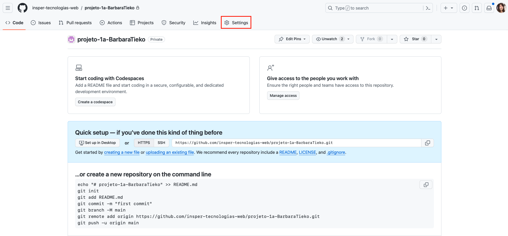

# Configuração do WebHook

1. Acesse a página do repositório do projeto no GitHub e clique na aba `Settings`/`Configurações`.
<figure markdown="span">
    { width="70%" }
    <figcaption>Configurações do repositório</figcaption>
</figure>

2. 