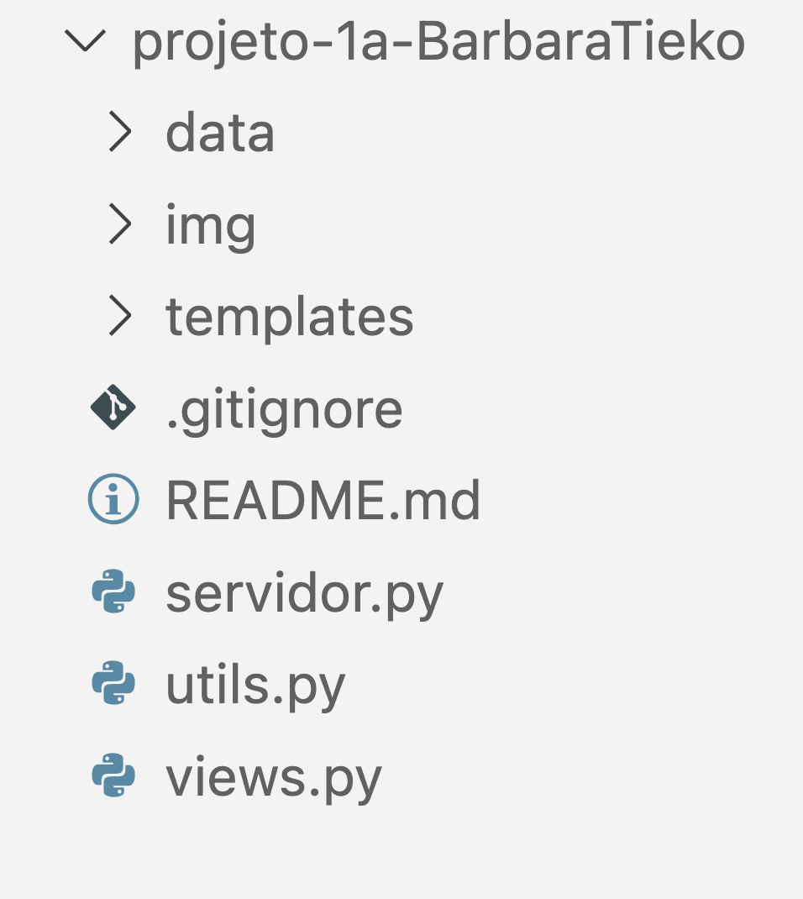

# Organização do repositório Github

Depois de configurar o WebHook do seu repositório Github vamos adicionar os arquivos referentes ao Handout 1.

Caso não tenha feito a configuração do WebHook, [clique aqui](configurando-webhook.md) para configurar.

## Estrutura de diretórios

O repositório do projeto deve seguir a seguinte estrutura de diretórios:

<figure markdown="span">
    { width="30%" }
    <figcaption>Organização do Repositório</figcaption>
</figure>

!!! danger "Importante"
    Como o projeto será corrigido automaticamente, é importante que você siga a estrutura de diretórios apresentada acima.

    Além disso, o arquivo principal do projeto deve se chamar `servidor.py`.

### Arquivo .gitignore
Existem arquivos que não devem ser versionados no repositório. Um exemplo é a pasta `__pycache__` que é criado pelo Python. Se você procurar em seu repositório Github criado para o handout 1 verá que este pasta está lá.

Essa pasta é desnecessária para o repositório, pois é criada automaticamente pelo Python. Para evitar que ela seja versionada, você deve criar um arquivo chamado `.gitignore` na raiz do seu repositório e adicionar o seguinte conteúdo:

```plaintext
__pycache__/
```

Faça um commit e um push. Agora podemos começar a tabalhar nas tarefas do Projeto 1A.

[Tarefas do Projeto 1A](tarefas-projeto1a.md){ .md-button }
