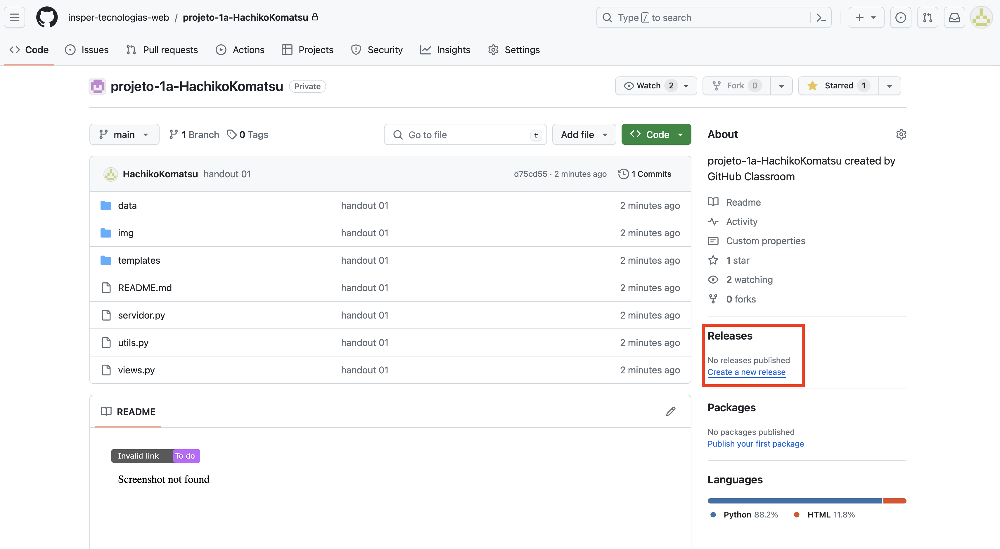
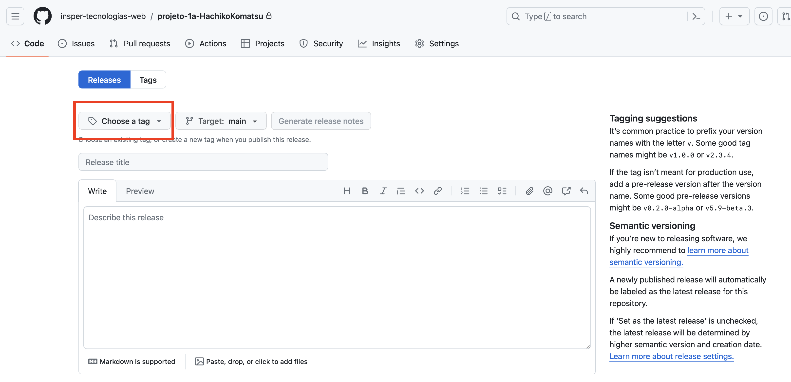
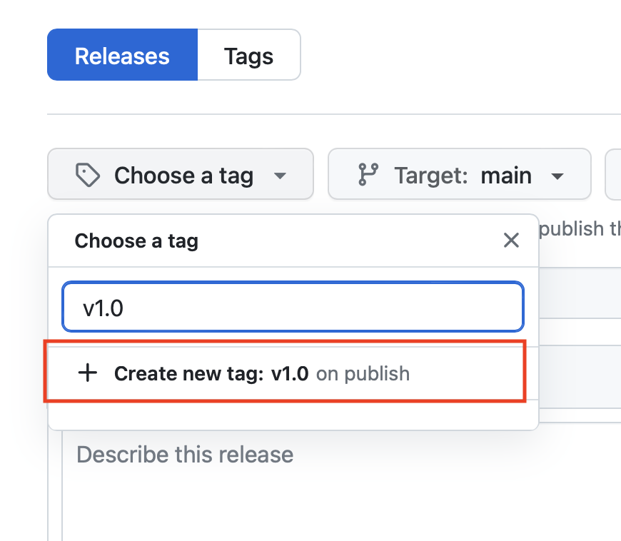
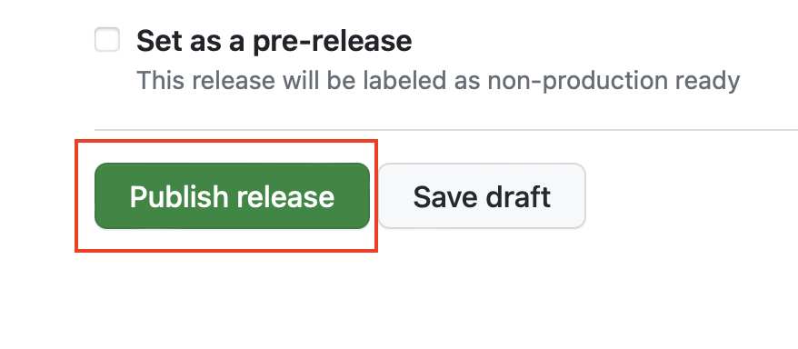
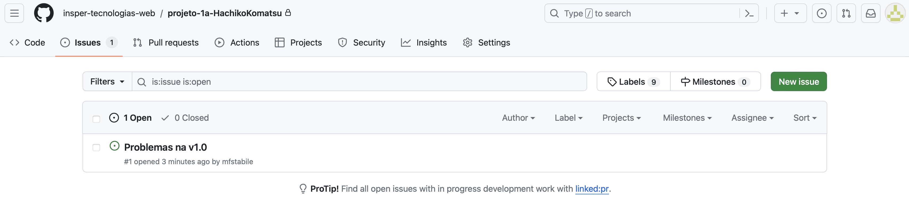
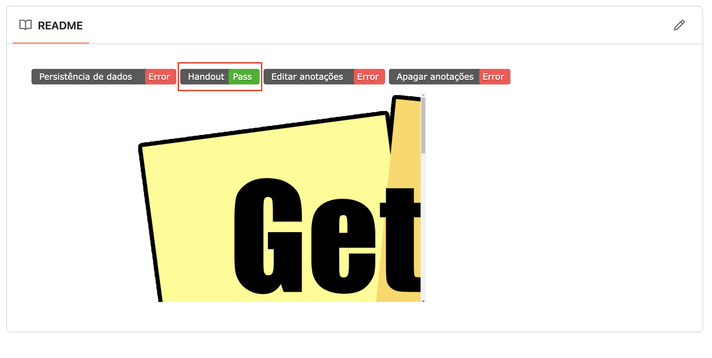

# Organização do repositório Github

Depois de configurar o WebHook do seu repositório Github vamos adicionar os arquivos referentes ao Handout 1.

Caso não tenha feito a configuração do WebHook, [clique aqui](configurando-webhook.md) para configurar.

## Estrutura de diretórios

O repositório do projeto deve seguir a seguinte estrutura de diretórios:

<figure markdown="span">
    { width="30%" }
    <figcaption>Organização do Repositório</figcaption>
</figure>

!!! danger "Importante"
    Como o projeto será corrigido automaticamente, é importante que você siga a estrutura de diretórios apresentada acima.

    Além disso, o arquivo principal do projeto deve se chamar `servidor.py`.

### Arquivo .gitignore
Existem arquivos que não devem ser versionados no repositório. Um exemplo é a pasta `__pycache__` que é criado pelo Python. Se você procurar em seu repositório Github criado para o handout 1 verá que este pasta está lá.

Essa pasta é desnecessária para o repositório, pois é criada automaticamente pelo Python. Para evitar que ela seja versionada, você deve criar um arquivo chamado `.gitignore` na raiz do seu repositório e adicionar o seguinte conteúdo:

```plaintext
__pycache__/
```

Faça um commit e um push. Agora vamos verificar se o webhook está funcionando corretamente.

## Criando um release

Para que o corretor automático possa corrigir o seu projeto, é necessário criar um release no Github. Para isso, siga os passos a seguir:

1. Acesse o repositório do seu projeto no Github. Procure o menu `Releases` e clique em `Create a new release`.

    <figure markdown="span">
        { width="100%" }
        <figcaption>Releases</figcaption>
    </figure>

2. **Clique no botão `Choose a tag`**
    <figure markdown="span">
        { width="100%" }
        <figcaption>Releases</figcaption>
    </figure>

3. Crie uma tag para o seu release. A tag deve ser `v1.0`.

    Sempre que for criar um realease, crie uma nova tag utilizando o padrão v1.0, v1.1, v1.2, etc. Caso a realease seja referente a uma nova funcionalidade implementada, incremente o primeiro número da tag. Por exemplo, se a release atual é v1.0 e você implementou uma nova funcionalidade, a tag da nova release deve ser v2.0. Caso a release seja referente a uma correção de bug, incremente o segundo número da tag. Por exemplo, se a release atual é v1.0 e você corrigiu um bug, a tag da nova release deve ser v1.1.

    <figure markdown="span">
        { width="50%" }
        <figcaption>Releases</figcaption>
    </figure>

    Digite o nome da tag e clique `+ Create new tag: v1.0`.

4. Preencha o campo `Release title` com o mesmo nome da tag `v1.0`, adicione uma descrição e clique em `Publish release`.

    <figure markdown="span">
        { width="60%" }
        <figcaption>Releases</figcaption>
    </figure>

Pronto! Agora os testes vão rodar. (Pode levar alguns minutos para que os testes sejam executados).

Caso os testes não passem, uma `issue` será aberta no seu repositório indicando o que está errado.

<figure markdown="span">
    { width="100%" }
    <figcaption>Issue</figcaption>
</figure>

Se tudo estiver correto, uma imagem aparecerá no README do seu repositório indicando que os testes para o handout 01 passaram.

<figure markdown="span">
    { width="100%" }
    <figcaption>Testes handout 01 ok</figcaption>
</figure>

Agora podemos começar a tabalhar nas tarefas do Projeto 1A.

[Tarefas do Projeto 1A](tarefas-projeto1a.md){ .md-button }
